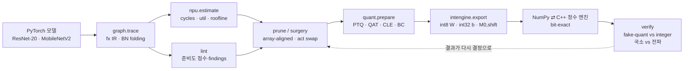

# npuloop — NPU에 올려보고 고르는 양자화·프루닝 툴킷

[](https://github.com/sokldjs554/npuloop/actions/workflows/ci.yml)

> **고객이 체크포인트를 보내왔을 때 NPU 회사의 모델 팀이 하는 일을, 감이 아니라 숫자로 하는 툴킷입니다.**
>
> `npuloop intake model.pt` 한 줄이면 **① 우리 NPU에서 돌기는 하는가**(op별로 MAC 배열 / depthwise 엔진 / 벡터 유닛 / 호스트 폴백),
> **② 얼마나 걸리는가**(해석적 systolic-array 비용 모델이 낸 사이클과 병목), **③ 무엇을 바꿔야 하는가**(활성함수 교체·프루닝 후보를
> *변형된 그래프에 비용 모델을 다시 돌려* 가격표를 붙인 처방)가 나옵니다.
>
> 처방을 적용한 뒤에는 int8 가중치·int32 바이어스·고정소수점 requant로 export한 정수 그래프를 NumPy와 C++ 커널로 **비트 단위로 같게**
> 실행해, fake-quant가 아니라 진짜 정수 결과로 정확도를 확인합니다.

## 3분 안에 보기

**1. 클릭만 (설치 없음).** 인터랙티브 데모 → **https://sokldjs554.github.io/npuloop/**
맨 위 **고객 모델 인테이크**에서 모델과 NPU를 바꿔 보세요. 접수 → 진단 → 처방이 그 자리에서 다시 계산됩니다.
(`docs/index.html` 한 파일짜리 정적 페이지입니다. 오프라인이면 저장소의 같은 파일을 브라우저로 열어도 됩니다.)


**2. 직접 실행 (데이터셋 다운로드·학습 없음, torch CPU + numpy만).** 저장소에 작은 체크포인트 2개와 CIFAR-10 샘플 1,012장
(`examples/quickstart/`, 6 MB)을 넣어 두었습니다. CPU 4코어 기준 **1분 안팎**(C++ 커널 컴파일 포함).

```bash
git clone https://github.com/sokldjs554/npuloop && cd npuloop && pip install -e .
make quickstart
```

| 명령 | 하는 일 |
|---|---|
| `npuloop intake` | 고객 B의 Inception-32를 `edge-10tops`에 접수 → 진단 → 처방 |
| `npuloop quantize` | ResNet-20을 PTQ하고 **fake-quant와 비트 정확 정수 엔진을 노드별로 대조** |
| `npuloop export` + `int8_runner` | 정수 그래프를 `.npuloop` 파일로 내보내고 **파이썬 없는 C++ 실행기**로 같은 답을 냄 |

**3. 전체 재현.** 데이터셋 준비·학습·실험은 [docs/USAGE.md](docs/USAGE.md), 실험 결과 전문은 [docs/EXPERIMENTS.md](docs/EXPERIMENTS.md)에 있습니다.
README와 실험 문서의 모든 표는 `results/*.json`에서 `make tables`로 생성됩니다.

## 무엇을, 왜

이전 프로젝트들([ondevice-pcb-inspection](https://github.com/sokldjs554/ondevice-pcb-inspection), [edgesight-soc](https://github.com/sokldjs554/edgesight-soc))에서
PTQ INT8 배포와 RTL NPU를 각각 만들고 나니 두 세계 사이에 구멍이 보였습니다. **모델 쪽**은 `torch.round`로 흉내 낸 fake-quant 정확도와 FLOPs로
결정하고, **하드웨어 쪽**은 int32 누산기·고정소수점 requant·배열 타일링으로 실제 사이클과 실제 정확도를 만듭니다.
"fake-quant가 90%면 NPU에서도 90%인가?", "FLOPs를 반으로 줄이면 사이클도 반이 되는가?"에 **숫자로** 답하는 것이 목표였습니다
(선행 연구 조사는 [docs/RELATED.md](docs/RELATED.md)).



## 고객이 체크포인트를 보내오면 (E9)

가상 고객 두 곳을 가정했습니다. **고객 A는 ViT**(attention 12개, LayerNorm 13개, GELU), **고객 B는 concat 분기 CNN**.
둘 다 이 저장소가 원래 거부하던 구조라 `concat`·`matmul`·`softmax`·`layernorm`·`transpose`를 IR·양자화·정수 엔진(NumPy와 C++ 모두)·비용 모델·lint에 새로 넣었습니다.

<!-- TABLE:E9 -->
**(a) 인테이크 요약** — `npuloop intake`가 낸 값 (사이클은 비용 모델, INT8은 정수 엔진 실측)

| 모델 | 파라미터 | MACs | edge-10tops cycles (활용률) | strict cycles | 온칩 실행 | lint eff / q-rob |
|---|---|---|---|---|---|---|
| 고객 B · Inception-32 | 423,066 | 54.0M | 31,224 (21.1%) | 31,224 | 예 / strict 예 | 91 / 97 |
| 고객 A · ViT-128/6 | 810,890 | 57.0M | 52,246 (13.3%) | 2,503,878 | 예 / strict 아니오 | 78 / 75 |
| 기존 · MobileNetV2-0.5 | 700,490 | 28.0M | 87,056 (3.5%) | 569,619 | 예 / strict 예 | 77 / 98 |
| 기존 · ResNet-20 ReLU | 272,474 | 40.8M | 34,417 (14.5%) | 34,417 | 예 / strict 예 | 80 / 97 |
| 기존 · ResNet-20 SiLU | 272,474 | 40.8M | 34,785 (14.3%) | 1,554,865 | 예 / strict 아니오 | 72 / 75 |

**(b) 처방을 실제로 적용한 결과**

| 모델 | 처방 | FP32 | INT8 정수 엔진 | edge-10tops cycles | strict cycles |
|---|---|---|---|---|---|
| 고객 A · ViT-128/6 | swap {'gelu': 'relu'} + heal 3 epochs | 80.98% → 80.95% | 80.80% → 81.00% | 52,246 → 52,054 | 2,503,878 → 1,708,230 |

온칩 실행 = 모든 op가 NPU에서 실행됨(호스트 폴백 없음). strict = LUT·softmax·layernorm 지원이 없는 프리셋.
<!-- /TABLE:E9 -->

* **같은 처방도 칩이 다르면 값이 달라집니다.** 고객 A의 GELU 6개를 ReLU로 바꾸는 처방은 LUT가 있는 `edge-10tops`에서 절감 **0%**(52,246 → 52,054 사이클),
  LUT가 없는 `edge-10tops-strict`에서는 **−32%**(2,503,878 → 1,708,230)입니다. 비용 모델을 루프 안에 두면 "이 칩에서 이 수술은 의미가 없다"를 재학습 전에 압니다.
* **그 처방으로도 부족하면 그렇게 말합니다.** 고객 A는 strict NPU에서 **사이클의 97%가 호스트 폴백**이고, 활성함수만 바꿔서는 layernorm 13개와 softmax 6개가 그대로 남습니다.
  리포트의 결론은 모델 수술이 아니라 **벡터 유닛이 있는 프리셋**입니다.
* **수술의 정확도 비용은 −0.03%p였습니다.** GELU→ReLU 교체 + 3 epoch healing으로 FP32 80.98% → 80.95%(E4의 SiLU→ReLU와 같은 패턴이 transformer에서도 재현).
* **attention은 fake-quant와 정수 엔진을 가장 크게 가릅니다.** 출력 코드 불일치가 CNN의 30~50%에서 74%로 오르고, 원인은 LayerNorm입니다(국소 불일치 24.7%).
  원인을 제거해 보는 후속 실험이 [E16](docs/EXPERIMENTS.md#e16)입니다.

## 이 숫자들을 어디까지 믿어도 되는가

<!-- TABLE:HEADLINE -->
| 질문 | `results/*.json`이 답하는 것 | 단, 검증되지 않은 것 |
|---|---|---|
| **정수 엔진을 믿어도 되는가** ([E11](docs/EXPERIMENTS.md#e11)) | TFLite reference 커널과 **1,000장 × 모든 텐서 0 불일치**(conv·pool은 gemmlowp 이중 반올림, fc는 단일 반올림) | 대조 범위는 conv(stride 1·2)·MEAN·fully-connected. depthwise·add·softmax는 미대조이고, TFLite 자신도 XNNPACK 경로와 reference가 155/1,000장 다릅니다 |
| **비용 모델이 맞는가** ([E8](docs/EXPERIMENTS.md#e8)) | SCALE-Sim v3와 12개 (모델, 배열) 조합에서 합계 오차 ≤ 0.08%, 최악 레이어 0.5% | 검증된 것은 dense conv·linear의 연산 사이클(단일 코어, 메모리 스톨 없음). depthwise·벡터 패스·멀티코어·DRAM roofline은 검증되지 않았습니다 |
| **그럼 실리콘에 가까운가** ([E13](docs/EXPERIMENTS.md#e13)) | Arm Vela 대비 **5/5 낙관적**(사이클 비 0.29~0.84) | **아니오.** 둘 다 해석적 추정기이고 Vela는 컴파일된 스케줄(fusion·타일링)을, 이쪽은 레이어를 하나씩 셉니다. E8의 일치는 하드웨어 충실도가 아니라 같은 이상화를 공유하는 두 모델이 같은 식을 같게 구현했다는 확인입니다 |
| **fake-quant 정확도를 믿어도 되는가** ([E2](docs/EXPERIMENTS.md#e2)·[E15](docs/EXPERIMENTS.md#e15)) | 12행 전부 95% 신뢰구간이 0을 품고 \|Δ\|/SE ≤ 1.6 — fake-quant 정확도는 정수 실행을 맞힙니다(\|Δ\| ≤ 0.20%p, test 전체) | E15·E16의 16개 비교를 다중비교 보정하지 않은 값입니다(E16까지 합치면 최대 \|Δ\|/SE 2.2). 모델 5개 + Imagenette 1개, 스킴 2개 범위 |
| **텐서도 같은가** ([E15](docs/EXPERIMENTS.md#e15)·[E16](docs/EXPERIMENTS.md#e16)) | 그러나 출력 코드는 28.5~72.7%가 다릅니다. 가장 큰 국소 원천(ViT의 LayerNorm)을 정수 산술로 바꿔 국소 불일치를 24.77% → 0.00%로 없애도 출력 코드 불일치는 72.7% → 65.7%까지만 내려갑니다 | 출력 코드 불일치는 test 전체, 국소 불일치는 125/250장 배치의 teacher-forced 값입니다 — 두 수를 같은 문장에서 섞지 마세요 |
| **싸구려 반올림의 값** ([E14](docs/EXPERIMENTS.md#e14)) | requant에서 반올림 대신 시프트를 쓰면 18개 (모델, 시드, 모드) 조합 **18개 전부**에서 손해입니다(-3.37~-0.90%p, \|Δ\|/SE 4.4~11.8) | 강건한 것은 부호와 유의성이고 **크기는 아닙니다**: SiLU의 truncate는 시드에 따라 −1.36~−2.98%p(시드 SD가 효과의 37%). 한 시드 숫자를 그 모드의 비용으로 인용하면 안 됩니다 |
| **그 밖의 정수 구현 세부** ([E7](docs/EXPERIMENTS.md#e7)) | 13개 구현 구성 중 7개는 무손실, 2개는 모델을 무너뜨립니다 (곱셈기 7비트·누산기 20비트까지는 공짜, 바이어스 12비트·누산기 16비트는 붕괴) | 바이어스 폭 축은 지수 조정 없는 **클리핑**을 재고(시판 NPU는 더 넓습니다 — Vela는 40비트), 누산기 포화는 부분합이 아니라 최종합에 한 번만 걸리며, 결과는 K ≤ 1,280인 이 모델들에 한정됩니다 |
<!-- /TABLE:HEADLINE -->

세 번째 열이 이 저장소의 성격입니다. 가상 NPU 비용 모델은 벤더 추정기와 대면시키면 낙관적이고(E13), 그 사실을 지우지 않고 적었습니다.

CPU 학습 중 만난 [oneDNN의 1×1 conv backward-weights 오버플로](docs/upstream/onednn_1x1_bwd_weights_rtus_overflow.md)는 benchdnn으로 단독 재현하고
2줄 패치까지 검증해 보고서로 정리했습니다. 이 저장소의 실험 모델들은 stride > 1인 1×1 conv의 입력 채널이 모두 16 이상이라 결과와 무관하며,
CI는 `ONEDNN_MAX_CPU_ISA=AVX2`로도 전체 스위트를 돌립니다.

## 실험 17개 (E1–E17)

전문과 표는 [docs/EXPERIMENTS.md](docs/EXPERIMENTS.md), 논문 형식 정리는 [기술 보고서](docs/report/npuloop_report.md)에 있습니다.

| # | 질문 | |
|---|---|---|
| E1 | 베이스라인 5개와 정적 분석(사이클·활용률·lint 점수) | [→](docs/EXPERIMENTS.md#e1) |
| E2 | PTQ 스킴 7개 × 모델 5개, fake-quant ↔ 비트 정확 정수 엔진 일치 | [→](docs/EXPERIMENTS.md#e2) |
| E3 | 정적 lint 점수가 실제 INT8 손실을 예측하는가 | [→](docs/EXPERIMENTS.md#e3) |
| E4 | 수술(CLE·바이어스 보정·활성함수 교체·QAT)이 손실을 얼마나 회복하는가 | [→](docs/EXPERIMENTS.md#e4) |
| E5 | 캘리브레이션은 몇 장이면 되는가 | [→](docs/EXPERIMENTS.md#e5) |
| E6 | PE-array 정렬 프루닝 — MACs와 사이클은 다르게 움직인다 | [→](docs/EXPERIMENTS.md#e6) |
| E7 | 정수 구현 세부(반올림·곱셈기 비트·누산기/바이어스 폭)의 정확도 비용 | [→](docs/EXPERIMENTS.md#e7) |
| E8 | 비용 모델은 믿을 만한가 — SCALE-Sim v3 대조 | [→](docs/EXPERIMENTS.md#e8) |
| E9 | 고객 모델 인테이크 — 접수 → 진단 → 처방 → 적용 | [→](docs/EXPERIMENTS.md#e9) |
| E10 | 검증 엔진은 얼마나 걸리는가 — 실측과 모델 사이클을 같은 표에 | [→](docs/EXPERIMENTS.md#e10) |
| E11 | 실제 런타임과 비트가 맞는가 — TensorFlow Lite reference 커널 교차 검증 | [→](docs/EXPERIMENTS.md#e11) |
| E12 | 데이터셋·입력 크기 축 — Imagenette 128×128 | [→](docs/EXPERIMENTS.md#e12) |
| E13 | 벤더 추정기와 대면 — Arm Vela(Ethos-U55-256) 대조 | [→](docs/EXPERIMENTS.md#e13) |
| E14 | 반올림 모드의 비용은 체크포인트에 강건한가 — 시드 3개 × 10,000장 | [→](docs/EXPERIMENTS.md#e14) |
| E15 | fake-quant ↔ 정수 차이에 쌍 표준오차를 붙이면 | [→](docs/EXPERIMENTS.md#e15) |
| E16 | LayerNorm을 정수로 에뮬레이션하면 transformer 격차가 닫히는가 | [→](docs/EXPERIMENTS.md#e16) |
| E17 | 출력 텐서가 결과물인 과제(초해상)에서는 격차가 어떻게 보이는가 | [→](docs/EXPERIMENTS.md#e17) |

## 설계에서 신경 쓴 것

* **양자화 지점이 NPU 데이터패스와 1:1.** ReLU 계열은 requant clamp에 융합되므로 활성함수 뒤에만 양자화기가 있고, SiLU/GELU/HardSwish는 int8 LUT라
  **앞에 양자화기가 하나 더** 들어갑니다. avgpool은 입력 스케일을 유지합니다([docs/INTEGER_DATAPATH.md](docs/INTEGER_DATAPATH.md)).
* **정수 산술은 참조 구현과 비트 동일.** `SaturatingRoundingDoublingHighMul`, `RoundingDivideByPOT`, TFLite add의 20비트 left-shift, avgpool의 half-away 반올림을
  그대로 구현했고, NumPy 엔진과 C++ 커널은 **모든 중간 텐서**가 같아야 테스트가 통과합니다.
* **불일치를 두 관점으로 분리.** fake-quant와 정수 엔진의 차이를 "국소(각 op에 fake-quant 코드를 teacher-forcing)"와 "전파(끝까지 정수로 실행)"로 나눠 재서,
  ±1 LSB가 어디서 생겨 어디까지 번지는지를 봅니다.
* **출처 라벨과 재현.** 실험 JSON의 모든 레코드에 `provenance: measured | simulated`가 붙고, 학습은 시드 고정·재개 가능(`state.pt`)합니다.
  프리셋 NPU는 공개 헤드라인 수치에 맞춘 **가정**이지 특정 벤더 구조가 아닙니다.
* **테스트가 실제 버그를 잡았습니다.** 프루닝으로 새로 만든 BatchNorm이 eval 모드를 물려받지 않던 버그, half-even 반올림의 shift=0 예외,
  서브셋 평가가 클래스 순서로 편향되던 문제가 전부 테스트에서 나왔습니다.

## 한계

* **CIFAR-10, 30 epoch, 시드 1개**(E14의 반올림 축만 3개). 정확도 차이 0.2%p 이하는 잡음이고, 결론은 "방향"이지 소수점 둘째 자리가 아닙니다.
* **체크포인트를 바꾸면 결론 일부가 흔들립니다** — E3의 레이어 수준 상관과 E7의 3비트 곱셈기 손실이 재학습 후 달라졌습니다.
* **가상 NPU.** 실제 칩의 컴파일러(fusion·타일링·메모리 스케줄링)와 다르고, 비용 모델은 dense GEMM 사이클만 검증했습니다(E8). 벤더 추정기 대조는 E13.
* **실측한 시간은 호스트 CPU의 검증 엔진뿐입니다**(E10). NPU 사이클·에너지는 전부 `simulated`이고, 에너지 상수는 자릿수 추정입니다.
* **지원 op**는 conv/dw-conv/grouped-conv · linear · add · mul · concat · matmul · softmax · layernorm · transpose/reshape · pool · elementwise 활성함수입니다.
  upsample·detection 헤드·KV 캐시는 아직입니다.
* **혼합 정밀도 없음**(INT8 고정), **프루닝 대상은 residual 밖의 내부 채널뿐**, **CLE의 이득을 보이지 못했습니다**(이 체크포인트들에는 CLE가 고칠 불균형이 없습니다).
* 각 항목의 근거와 나머지 한계는 [docs/EXPERIMENTS.md](docs/EXPERIMENTS.md)의 해당 실험 절에 있습니다.

## 직접 돌려보기

```bash
pip install -e .[dev]           # torch(CPU), numpy, pytest
make quickstart                 # 데이터·학습 없이 1분: intake → quantize/verify → export + C++ runner
python -m pytest -q             # 87 tests (C++ 커널은 첫 실행 때 g++로 컴파일됩니다)
make tables                     # results/*.json -> README·docs/EXPERIMENTS.md의 표를 다시 생성
```

CLI는 여섯 동사입니다: `npuloop cost | lint | intake | quantize | export | bench`.
데이터셋 준비, 학습, 실험 재현, 파이썬 API는 [docs/USAGE.md](docs/USAGE.md)에 있습니다
(경로 기본값은 `runs/`와 `data/cifar10.npz`이고 각각 `NPULOOP_RUNS`·`NPULOOP_DATA`로 바꿉니다).

```
npuloop/
├── graph/ir.py          torch.fx → StaticGraph (BN folding, shape 전파)
├── npu/                 가상 NPU 프리셋 4종 + weight-stationary systolic 비용 모델
├── lint/                정적·동적 준비도 점검 → efficiency / quant-robustness 점수
├── quant/               관측기 · fake-quant · NPU식 양자화기 삽입 · CLE · 바이어스 보정 · QAT · 정수 LayerNorm 에뮬레이션
├── intengine/           IntGraph export · gemmlowp/TFLite 동일 requant · NumPy 엔진 · C++ 커널 · 검증 · `.npuloop` 직렬화
├── prune/               fx 그래프 채널 그룹에 uniform · aligned · cost-greedy(비용 모델 in-the-loop) 프루닝
├── zoo/                 npz 로더(CIFAR-10·Imagenette) · 모델 · 재현 가능한 트레이너
└── cli.py
experiments/             E1–E17 스크립트 (재개 가능)
results/                 실험 결과 JSON (provenance 라벨 포함)
demo/                    build.py + 템플릿 → docs/index.html
tests/                   pytest 87개
examples/                walkthrough.py · quickstart/ (번들 체크포인트 + CIFAR-10 샘플)
tools/                   표 생성 · 데이터셋 준비 · 보고서 빌드 · oneDNN 재현 스크립트
docs/                    EXPERIMENTS · USAGE · DESIGN · INTEGER_DATAPATH · RELATED · report/ · upstream/
```

## 더 읽을 것

| 문서 | 내용 |
|---|---|
| [docs/EXPERIMENTS.md](docs/EXPERIMENTS.md) | 실험 E1–E17 전문과 생성된 표 |
| [docs/report/npuloop_report.md](docs/report/npuloop_report.md) | 논문 형식 기술 보고서 ([PDF](docs/report/npuloop_report.pdf)) |
| [docs/DESIGN.md](docs/DESIGN.md) | 아키텍처, 모듈, 실험 계획, 검증 원칙 |
| [docs/INTEGER_DATAPATH.md](docs/INTEGER_DATAPATH.md) | 양자화 지점과 정수 데이터패스의 대응 |
| [docs/RELATED.md](docs/RELATED.md) | 선행 연구와 이 저장소의 위치 |
| [docs/USAGE.md](docs/USAGE.md) | 설치·학습·CLI·실험 재현·파이썬 API |
| [docs/upstream/](docs/upstream/) | oneDNN 버그 보고서와 패치 |
| [paper/](paper/) | 4쪽 원고 초고 — IEEE ESL 투고용 영문본과 한국어판 (본문 수치는 `results/*.json`에서 생성) |
| [라이브 데모](https://sokldjs554.github.io/npuloop/) | `results/*.json`을 읽는 인터랙티브 페이지 |

## 데이터와 외부 도구

데이터: CIFAR-10 (Krizhevsky, 2009), Imagenette (fast.ai).
SCALE-Sim은 E8, ethos-u-vela는 E13 검증 실험에서만 사용합니다.
