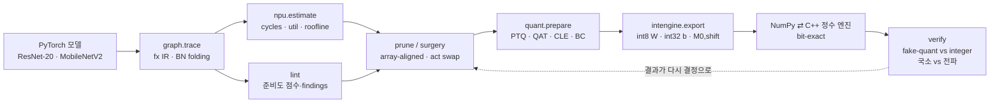

# npuloop — NPU 비용 모델과 비트 정확 정수 엔진으로 닫는 모델 압축 루프

> **"INT8 NPU에 올릴 모델의 양자화·프루닝·활성함수 선택을, FLOPs와 fake-quant가 아니라
> 가상 NPU 비용 모델과 비트 정확(bit-exact) 정수 추론 엔진에 대고 검증한다."**
>
> 해석적 systolic-array 비용 모델(`npu`) → 정적 준비도 lint(`lint`) → NPU 방식 양자화·QAT·CLE·활성함수 교체(`quant`)
> → PE-array 정렬 구조적 프루닝(`prune`) → int8 가중치/int32 바이어스/고정소수점 requant로 export한 정수 그래프를
> NumPy와 C++ 커널로 **비트 단위로 같게** 실행하고 fake-quant와 비교(`intengine`)하는 한 저장소입니다.
> CIFAR-10에서 ResNet-20 계열 4종과 MobileNetV2로 7개 실험(E1–E7)을 돌려 결과를 JSON으로 남겼고, 그 JSON을 읽는
> [인터랙티브 데모](#데모)가 있습니다.

<!-- RESULTS_SUMMARY -->

## 왜 이 프로젝트를 했나

이전 프로젝트들([ondevice-pcb-inspection](https://github.com/sokldjs554/ondevice-pcb-inspection), [edgesight-soc](https://github.com/sokldjs554/edgesight-soc))에서
PTQ INT8 배포와 RTL NPU를 각각 만들어 보고 나니, 두 세계 사이에 구멍이 하나 보였습니다.

* **모델 쪽**은 `torch.round`로 흉내 낸 fake-quant 정확도와 FLOPs로 결정을 내리고,
* **하드웨어 쪽**은 int32 누산기·고정소수점 requant·배열 타일링으로 실제 사이클과 실제 정확도를 만듭니다.

둘 사이의 차이를 개인 프로젝트 수준에서 정량화한 저장소는 찾지 못했습니다(조사 내용은 [docs/RELATED.md](docs/RELATED.md)).
"fake-quant가 90%라고 하면 NPU에서도 90%인가?", "FLOPs를 반으로 줄이면 사이클도 반이 되는가?",
"SiLU를 ReLU로 바꾸면 무엇을 얻고 잃는가?"에 **숫자로** 답하는 것이 목표였습니다.

## 폐루프 구조



<!-- SECTIONS -->

## 저장소 구조

```
npuloop/
├── graph/ir.py          torch.fx → StaticGraph (BN folding, shape 전파, 미지원 op 즉시 실패)
├── npu/spec.py, cost.py 가상 NPU 프리셋 4종 + weight-stationary systolic 비용 모델 (멀티코어 M/N 분할, DW 엔진, LUT/폴백, DRAM roofline)
├── lint/checks.py       정적·동적 준비도 점검 → efficiency / quant-robustness 점수
├── quant/               관측기(minmax·percentile·MSE), fake-quant(STE·LSQ), NPU식 삽입(prepare), 캘리브레이션, CLE, 바이어스 보정, 민감도, 활성함수 교체, QAT
├── intengine/           IntGraph export, gemmlowp/TFLite 동일 requant, NumPy 엔진, C++ 커널(ctypes), fake-vs-int 검증
├── prune/structured.py  채널 프루닝: uniform · aligned · cost-greedy(비용 모델 in-the-loop)
├── zoo/                 CIFAR-10 npz 로더, 모델, 재현 가능한 트레이너(resume)
└── cli.py               npuloop cost | lint | quantize
experiments/             E1–E7 스크립트 (재개 가능, results/*.json에 provenance 라벨과 함께 저장)
results/                 실험 결과 JSON
demo/                    build.py + index.template.html → 인라인 JSON 데모 페이지 (docs/index.html)
tests/                   pytest 44개 (참조 구현 대조, 비트 동일성, 정확성 회귀)
docs/                    DESIGN.md · INTEGER_DATAPATH.md · RELATED.md
```

## 빠른 시작

```bash
pip install -e .[dev]           # torch(CPU), numpy, pytest
python -m pytest -q             # 44 tests, ~5 s (C++ 커널은 첫 실행 때 g++로 컴파일)

# CIFAR-10 (npz 한 파일) 준비: tools/prepare_cifar10.py 참고
python -m npuloop.zoo.train --arch resnet --act relu --epochs 30 --out runs/resnet20_relu --data data/cifar10.npz

npuloop cost runs/resnet20_relu/best.pt --spec edge-10tops          # 레이어별 사이클/활용률 표
npuloop lint runs/resnet20_relu/best.pt --spec edge-10tops --data data/cifar10.npz
npuloop quantize runs/resnet20_relu/best.pt --data data/cifar10.npz --scheme npu-default --verify 500 --int-eval 2000

bash experiments/run_all.sh     # E1–E7 전부 (CPU 4코어 기준 수 시간), results/*.json
python demo/build.py            # results → demo/index.html, docs/index.html
```

파이썬 API 한 줄 요약:

```python
from npuloop.zoo import load_checkpoint, CIFAR10NPZ
from npuloop.graph import trace
from npuloop.npu import estimate
from npuloop.lint import lint
from npuloop.quant import prepare, calibrate, evaluate, QScheme
from npuloop.intengine import export_int_graph, NumpyEngine
from npuloop.intengine.cpp_engine import CppEngine
from npuloop.intengine.verify import compare, agreement_table

m = load_checkpoint("runs/resnet20_relu/best.pt"); ds = CIFAR10NPZ("data/cifar10.npz")
print(estimate(trace(m), "edge-10tops").table())                     # simulated cycles
print(lint(trace(m), "edge-10tops", ds.calib_batch(64).numpy()).markdown())
qm = prepare(m, QScheme()); calibrate(qm, [ds.calib_batch(256)])
ig = export_int_graph(qm)                                             # int8/int32/M0,shift
rows, summary = compare(qm, ig, ds.calib_batch(200)); print(agreement_table(rows), summary)
print(NumpyEngine(ig).evaluate(ds, limit=2000), CppEngine(ig).evaluate(ds, limit=2000))
```

<!-- TAIL -->
