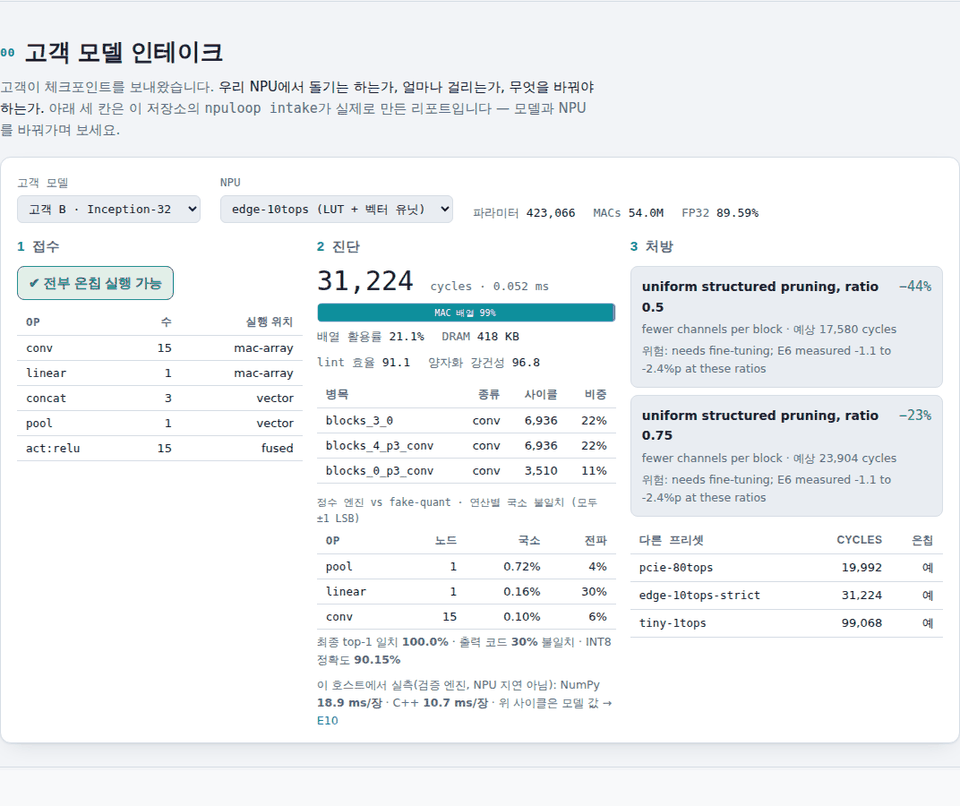
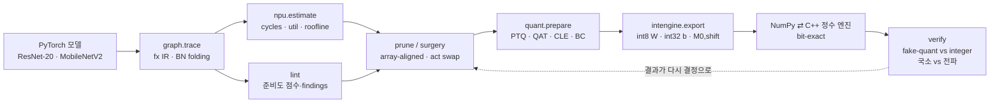

# npuloop — NPU에 올려보고 고르는 양자화·프루닝 툴킷

[](https://github.com/sokldjs554/npuloop/actions/workflows/ci.yml)
[](LICENSE)

> **고객이 체크포인트를 보내왔을 때 NPU 회사의 모델 팀이 하는 일을, 감이 아니라 숫자로 하는 툴킷입니다.**
>
> `npuloop intake model.pt` 한 줄이면 세 가지가 나옵니다.
> **① 우리 NPU에서 돌기는 하는가** — op별로 MAC 배열 / depthwise 엔진 / 벡터 유닛 / 호스트 폴백 중 어디로 가는지.
> **② 얼마나 걸리는가** — 해석적 systolic-array 비용 모델(SCALE-Sim과 레이어당 0.5% 이내로 대조)이 낸 사이클과 병목.
> **③ 무엇을 바꿔야 하는가** — 활성함수 교체·프루닝 후보를 각각 *변형된 그래프에 비용 모델을 다시 돌려* 가격표를 붙인 처방.
>
> 처방을 실제로 적용한 뒤에는 int8 가중치/int32 바이어스/고정소수점 requant로 export한 정수 그래프를 NumPy와 C++ 커널로
> **비트 단위로 같게** 실행해서, fake-quant가 아니라 진짜 정수 결과로 정확도를 확인합니다.
> CIFAR-10에서 CNN 3종 + 가상 고객 2곳(ViT 81.0% · concat 분기 CNN 89.6%)으로 12개 실험(E1–E12)을 돌린 결과가 JSON으로 있고,
> 그 JSON을 읽는 [인터랙티브 데모](#데모)가 있습니다.


## 3분 안에 보기

**1. 클릭만 (설치 없음).** 인터랙티브 데모 → https://claude.ai/code/artifact/8112e532-a441-4118-9cc1-fb939e3dab49
(같은 페이지가 `docs/index.html`이므로 GitHub Pages `https://sokldjs554.github.io/npuloop/`로도 열립니다.)
맨 위 **고객 모델 인테이크**에서 모델과 NPU를 바꿔 보세요. 접수 → 진단 → 처방이 그 자리에서 다시 계산됩니다.



**2. 30초 실행 (데이터셋 다운로드·학습 없음, torch CPU + numpy만).** 저장소에 작은 체크포인트 2개(ResNet-20 ReLU, 고객 B Inception-32)와
CIFAR-10 샘플 1,012장(`examples/quickstart/`, 6 MB)을 넣어 두었습니다.

```bash
git clone https://github.com/sokldjs554/npuloop && cd npuloop && pip install -e .
make quickstart      # 아래 세 명령을 차례로 실행 (CPU 4코어 기준 약 40초, C++ 커널 컴파일 포함)
```

| 명령 | 무엇이 나오나 | 시간 |
|---|---|---|
| `npuloop intake examples/quickstart/cust_inception.pt --data examples/quickstart/cifar10_sample.npz --spec edge-10tops` | 고객 모델 인테이크 리포트: op별 실행 위치 → 사이클·병목·에너지 → 프루닝 처방과 다른 프리셋 비교(데모의 인테이크 칸과 같은 내용) | 9초 |
| `npuloop quantize examples/quickstart/resnet20_relu.pt --data examples/quickstart/cifar10_sample.npz --verify 200 --int-eval 500` | PTQ 뒤 fake-quant와 정수 엔진의 노드별 일치도 표, 그리고 NumPy·C++ 정수 엔진(비트 동일)이 잰 INT8 정확도(샘플 500장 기준 88.6%) | 21초 |
| `npuloop export … --out model.npuloop --sample 8` + `make runner` + `build/int8_runner model.npuloop input.f32 --float --argmax` | 정수 그래프를 `.npuloop` 파일로 내보내고, 파이썬 없는 C++ 실행기가 같은 파일로 같은 답을 냅니다 | 2초 |

**3. 전체 재현.** CIFAR-10 전체와 학습부터 하려면 [빠른 시작](#빠른-시작)과 `experiments/`를 보세요. README의 모든 표는 `results/*.json`에서 스크립트로 생성됩니다.


## 왜 이 프로젝트를 했나

이전 프로젝트들([ondevice-pcb-inspection](https://github.com/sokldjs554/ondevice-pcb-inspection), [edgesight-soc](https://github.com/sokldjs554/edgesight-soc))에서
PTQ INT8 배포와 RTL NPU를 각각 만들어 보고 나니, 두 세계 사이에 구멍이 하나 보였습니다.

* **모델 쪽**은 `torch.round`로 흉내 낸 fake-quant 정확도와 FLOPs로 결정을 내리고,
* **하드웨어 쪽**은 int32 누산기·고정소수점 requant·배열 타일링으로 실제 사이클과 실제 정확도를 만듭니다.

둘 사이의 차이를 개인 프로젝트 수준에서 정량화한 저장소는 찾지 못했습니다(조사 내용은 [docs/RELATED.md](docs/RELATED.md)).
"fake-quant가 90%라고 하면 NPU에서도 90%인가?", "FLOPs를 반으로 줄이면 사이클도 반이 되는가?",
"SiLU를 ReLU로 바꾸면 무엇을 얻고 잃는가?"에 **숫자로** 답하는 것이 목표였습니다.

## 폐루프 구조




## 실험 결과 (CIFAR-10, seed 0, CPU 4코어)

숫자는 전부 `results/*.json`에서 `tools/readme_tables.py --inject README.md`로 생성한 것입니다. 정확도는 test 10,000장 기준이며,
`simulated`로 표시한 사이클·활용률은 가상 NPU 비용 모델 값입니다.

**데이터 분할과 체크포인트 선택.** CIFAR-10의 공식 학습 50,000장을 고정 시드로 **학습 45,000장 / 검증 5,000장**(클래스별 500장, 층화)으로
한 번 나눴습니다(`npuloop/zoo/data.py`). 학습 중 체크포인트 선택(`best.pt` = 검증 정확도가 가장 높은 epoch)과 학습 시점의 모든 결정은
검증 분할로만 하고, test 10,000장은 선택된 체크포인트에 대해 마지막에 한 번 평가합니다. 캘리브레이션 이미지도 학습 분할에서만 뽑습니다.
QAT·healing·프루닝 후 미세조정은 마지막 epoch 모델을 그대로 쓰므로(선택 없음) test를 들여다볼 기회가 없습니다.

### E9. 고객 모델 인테이크 — 이 프로젝트가 답하는 질문

가상 고객 두 곳이 체크포인트를 보내왔다고 가정했습니다. **고객 A는 ViT**(attention 12개, LayerNorm 13개, GELU),
**고객 B는 concat 분기 CNN**(블록마다 1×1·3×3·5×5 세 갈래를 채널 축으로 이어 붙임). 둘 다 이 저장소가 원래 거부하던 구조라,
`concat`·`matmul`·`softmax`·`layernorm`·`transpose`를 IR·양자화·정수 엔진(NumPy와 C++ 모두)·비용 모델·lint에 새로 넣었습니다.

`npuloop intake <ckpt> --spec <npu>`가 내는 리포트는 세 부분입니다.

1. **접수** — op별로 어디서 실행되는지(MAC 배열 / depthwise 엔진 / 벡터 유닛 / int8 LUT / requant에 융합 / **호스트 폴백**)와, 전부 온칩에서 도는지 여부.
2. **진단** — 사이클·지연·배열 활용률·DRAM, 사이클 예산을 실행 유닛별로 나눈 비율, 병목 3개, lint 점수.
3. **처방** — 후보 변경(활성함수 교체, 프루닝)을 **변형된 그래프에 비용 모델을 다시 돌려** 예상 사이클과 함께 제시하고, 같은 모델을 다른 프리셋에 올렸을 때의 사이클도 따로 보여 줍니다.

관찰:

* **같은 처방도 NPU가 다르면 값이 완전히 달라집니다.** 고객 A의 GELU 6개를 ReLU로 바꾸는 처방은 LUT가 있는 `edge-10tops`에서는 절감 **0%**(52,246 → 52,054 사이클)입니다 — GELU가 이미 싸게 돌고 있으니까요. LUT가 없는 `edge-10tops-strict`에서는 같은 처방이 **−32%**(2,503,878 → 1,708,230)입니다. 비용 모델을 루프 안에 두면 "이 칩에서는 이 수술이 의미가 없다"를 재학습 전에 알 수 있습니다.
* **그리고 그 처방으로도 부족하다고 정직하게 말합니다.** 고객 A는 strict NPU에서 **사이클의 97%가 호스트 폴백**이고(layernorm 13개 · softmax 6개 · GELU 6개), 활성함수만 바꿔서는 layernorm과 softmax가 그대로 남습니다. lint 효율 점수는 30.9 → 85.9로 오르지만 여전히 온칩 실행 불가입니다. 리포트의 결론은 모델 수술이 아니라 **벡터 유닛이 있는 프리셋**(edge-10tops 52,246 · pcie-80tops 27,843)입니다.
* **수술의 정확도 비용은 −0.03%p였습니다.** GELU→ReLU 교체 후 3 epoch healing으로 FP32 80.98% → 80.95%, INT8 정수 엔진은 80.80% → 81.00%(2,000장 기준). E4에서 SiLU→ReLU가 3 epoch로 회복된 것과 같은 패턴이 transformer에서도 재현됩니다.
* **attention은 정수 엔진과 fake-quant를 훨씬 크게 갈라놓습니다.** 최종 출력 코드 불일치가 CNN의 30~50%에서 **74%**로 올라가는데도 top-1 일치는 96.9%입니다. 레이어별로 국소(teacher-forced) 불일치를 재면 원인이 분명합니다 — **LayerNorm이 24.7%(최대 26.1%)로 압도적**이고 pool 0.8%, softmax 0.5%, matmul 0.27%, linear 0.08% 순입니다. 정수 LayerNorm은 int64 합과 정확한 정수 제곱근으로 정규화하고 fake-quant는 float32로 계산한 뒤 격자에 올리기 때문에, 네 개 중 하나꼴로 반올림 경계의 반대편에 떨어집니다(모두 ±1 LSB). **"transformer를 INT8로 올릴 때 먼저 의심할 곳은 LayerNorm"**이라는 것이 이 실험의 결론입니다.
* **고객 B는 정확도 쪽에서는 고칠 게 없었습니다.** concat 세 곳의 브랜치 범위 차이가 1.4~2.0배뿐이라 공유 스케일로 합쳐도 손해가 없고(lint `concat-scale-mismatch` = info), 두 프리셋 모두 온칩에서 돌며(31,224 사이클, 활용률 21.1%) INT8 손실도 없습니다(FP32 89.59% → 정수 엔진 89.56%, 10,000장). 처방은 **프루닝**입니다: 첫 버전의 프루너는 이 그래프에서 자를 그룹을 하나도 못 찾아 리포트가 "도구의 한계"를 적었지만, 그래프 기반으로 다시 짠 프루너는 concat 브랜치 출력과 5×5 브랜치 내부 채널을 그룹으로 찾아 ratio 0.5에서 edge-10tops 사이클 **−44%**(예측)를 제시합니다. 실제로 잘라 3 epoch 미세조정한 결과는 E6 표에 있습니다.

<!-- TABLE:E9 -->
**(a) 인테이크 요약** — `npuloop intake`가 낸 값 (사이클은 비용 모델, INT8은 정수 엔진 실측)

| 모델 | 파라미터 | MACs | edge-10tops cycles (활용률) | strict cycles | 온칩 실행 | lint eff / q-rob |
|---|---|---|---|---|---|---|
| 고객 B · Inception-32 | 423,066 | 54.0M | 31,224 (21.1%) | 31,224 | 예 / strict 예 | 91 / 97 |
| 고객 A · ViT-128/6 | 810,890 | 57.0M | 52,246 (13.3%) | 2,503,878 | 예 / strict 아니오 | 78 / 75 |
| 기존 · MobileNetV2-0.5 | 700,490 | 28.0M | 87,056 (3.5%) | 569,619 | 예 / strict 예 | 77 / 98 |
| 기존 · ResNet-20 ReLU | 272,474 | 40.8M | 34,417 (14.5%) | 34,417 | 예 / strict 예 | 80 / 97 |
| 기존 · ResNet-20 SiLU | 272,474 | 40.8M | 34,785 (14.3%) | 1,554,865 | 예 / strict 아니오 | 72 / 75 |

**(b) 처방을 실제로 적용한 결과**

| 모델 | 처방 | FP32 | INT8 정수 엔진 | edge-10tops cycles | strict cycles |
|---|---|---|---|---|---|
| 고객 A · ViT-128/6 | swap {'gelu': 'relu'} + heal 3 epochs | 80.98% → 80.95% | 80.80% → 81.00% | 52,246 → 52,054 | 2,503,878 → 1,708,230 |

온칩 실행 = 모든 op가 NPU에서 실행됨(호스트 폴백 없음). strict = LUT·softmax·layernorm 지원이 없는 프리셋.
<!-- /TABLE:E9 -->

### E1. 베이스라인과 정적 분석

같은 레시피(30 epoch OneCycle SGD, ViT만 40 epoch AdamW)로 훈련한 5개 모델을 가상 NPU 프리셋에 올렸을 때의 사이클과 lint 점수입니다.
ResNet-20의 16/32 채널은 64폭 배열의 열을 1/4~1/2밖에 채우지 못해 2코어 64×64(edge-10tops)에서 배열 활용률이 14%, 8코어(pcie-80tops)에서는 5%까지 떨어지고, 32×32 배열(tiny-1tops)에서는 45%로 올라갑니다.
지연 시간은 큰 NPU가 짧지만 실리콘의 대부분이 놀고 있다는 뜻이고, "작은 모델에는 큰 배열이 낭비"라는 것이 첫 번째 관찰입니다.
SiLU 모델은 strict 프리셋(LUT 없음, 호스트 폴백)에서 사이클이 45배로 뛰고 lint의 효율성·강건성 점수가 모두 떨어집니다.
FP32 정확도는 분석 대상 체크포인트(`best.pt`, 검증 정확도 기준으로 고른 epoch)를 test에서 다시 평가한 값이라 E2·E4·E6의 FP32와 정확히 같습니다.

<!-- TABLE:E1 -->
| 모델 | 파라미터 | MACs | val acc (선택 epoch) | test acc | tiny-1tops cycles (util) | edge-10tops cycles (util) | pcie-80tops cycles (util) | edge-10tops µJ/장 (simulated) | lint eff / q-rob |
|---|---|---|---|---|---|---|---|---|---|
| ResNet-20 ReLU | 272,474 | 40.8M | 90.24% (ep 30) | 89.59% | 87,730 (45%) | 34,417 (14%) | 22,791 (5%) | 56.9 | 80 / 98 |
| ResNet-20 SiLU | 272,474 | 40.8M | 90.22% (ep 30) | 90.34% | 90,674 (44%) | 34,785 (14%) | 22,817 (5%) | 57.9 | 72 / 75 |
| MobileNetV2-0.5 ReLU6 | 700,490 | 28.0M | 90.58% (ep 30) | 90.23% | 200,536 (12%) | 87,056 (3%) | 67,351 (1%) | 129.1 | 77 / 98 |
| 고객 A · ViT-128/6 | 810,890 | 57.0M | 81.68% (ep 39) | 80.98% | 164,556 (34%) | 52,246 (13%) | 32,379 (5%) | 155.5 | 78 / 75 |
| 고객 B · Inception-32 | 423,066 | 54.0M | 89.74% (ep 30) | 89.59% | 99,068 (53%) | 31,224 (21%) | 19,992 (8%) | 84.8 | 91 / 97 |
<!-- /TABLE:E1 -->

### E8. 비용 모델은 믿을 만한가 — SCALE-Sim 대조

해석적 모델의 연산 사이클을 SCALE-Sim v3(사이클 정확 systolic 시뮬레이터, WS dataflow, 대역폭 제한 없음)와 레이어별로 비교했습니다.
처음 만든 모델(타일당 `M + R + C`)은 10~13% 낙관적이었고, SCALE-Sim의 per-fold 사이클을 뜯어보니 가중치 타일을 배열에 싣는 `R` 사이클이 빠져 있었습니다.
`M + 2R + C − 2`로 고친 뒤에는 세 배열 크기 모두에서 합계 0.03%, 최악 레이어 0.5%(FC의 off-by-one) 이내입니다.

**검증 범위는 systolic GEMM 사이클뿐입니다.** dense conv와 (토큰 단위) linear를 단일 코어, 메모리 스톨 없음 조건으로 대조한 것이고,
depthwise conv(npuloop에서는 별도 depthwise 엔진, SCALE-Sim의 conv 형식에는 groups가 없음), activation×activation matmul,
softmax·LayerNorm·add·pool 같은 벡터 패스, 멀티코어 분할, DRAM roofline은 해석적 값 그대로이며 여기서 검증되지 않았습니다.

<!-- TABLE:E8 -->
| 모델 | 배열 | SCALE-Sim cycles | npuloop cycles | 비율 | 최악 레이어 오차 | fill/drain 없이 |
|---|---|---|---|---|---|---|
| ResNet-20 ReLU | 32×32 | 84,276 | 84,298 | 1.0003 | 0.5% | 0.683 |
| ResNet-20 ReLU | 64×64 | 49,123 | 49,145 | 1.0004 | 0.5% | 0.614 |
| ResNet-20 ReLU | 16×16 | 208,486 | 208,508 | 1.0001 | 0.5% | 0.766 |
| MobileNetV2-0.5 ReLU6 | 32×32 | 108,030 | 108,066 | 1.0003 | 0.2% | 0.350 |
| MobileNetV2-0.5 ReLU6 | 64×64 | 70,074 | 70,110 | 1.0005 | 0.2% | 0.277 |
| MobileNetV2-0.5 ReLU6 | 16×16 | 217,226 | 217,262 | 1.0002 | 0.1% | 0.456 |
| 고객 B · Inception-32 | 32×32 | 96,108 | 96,124 | 1.0002 | 0.2% | 0.587 |
| 고객 B · Inception-32 | 64×64 | 43,720 | 43,736 | 1.0004 | 0.2% | 0.488 |
| 고객 B · Inception-32 | 16×16 | 289,122 | 289,138 | 1.0001 | 0.1% | 0.737 |
| 고객 A · ViT-128/6 | 32×32 | 122,950 | 122,988 | 1.0003 | 0.3% | 0.404 |
| 고객 A · ViT-128/6 | 64×64 | 49,620 | 49,658 | 1.0008 | 0.3% | 0.250 |
| 고객 A · ViT-128/6 | 16×16 | 340,898 | 340,936 | 1.0001 | 0.3% | 0.581 |
<!-- /TABLE:E8 -->

### E10. 검증 엔진은 얼마나 걸리는가 — 실측과 모델을 같은 표에

이 저장소에서 **실측**할 수 있는 시간은 비트 정확 검증 엔진 두 개(NumPy int64 워크, C++ 커널)가 호스트 CPU에서 도는 시간뿐이고,
NPU 사이클은 전부 **모델** 값입니다. 둘을 섞어 읽지 않도록 같은 노드에 대해 실측 ms와 모델 사이클을 나란히 둡니다
(`npuloop bench`, `npuloop intake --bench`). 처음 잰 C++ 엔진은 순진한 7중 루프라 NumPy(내부적으로 torch conv2d)보다 3배
**느렸고**, im2col + int32 GEMM(4탭 블록, 정확성은 `K·max|x−zp|·128 < 2³¹`일 때만 int32 누산)으로 고쳐 2~6배 빠르게 만든 뒤의 값입니다.

<!-- TABLE:E10 -->
이 호스트(Intel(R) Xeon(R) Processor @ 2.80GHz, 스레드 1개)에서 64장 배치를 5회 돌린 중앙값입니다. **검증 엔진의 실측이지 NPU 지연이 아닙니다** — 마지막 열은 같은 모델의 비용 모델 값이며 둘은 다른 질문에 답합니다.

| 모델 | 노드 | NumPy 엔진 ms/장 | C++ 엔진 ms/장 | C++/NumPy | 가장 비싼 op (C++ 기준) | 두 엔진 출력 코드 동일 | 비용 모델 edge-10tops (simulated) |
|---|---|---|---|---|---|---|---|
| ResNet-20 ReLU | 35 | 20.4 | 10.5 | 1.9× | conv 85% · add 15% | 2,000/2,000장 | 34,417 cycles (0.057 ms) |
| ResNet-20 SiLU | 54 | 25.9 | 10.8 | 2.4× | conv 79% · add 15% | 2,000/2,000장 | 34,785 cycles (0.058 ms) |
| MobileNetV2-0.5 ReLU6 | 67 | 66.5 | 20.5 | 3.3× | conv 95% · add 4% | 2,000/2,000장 | 87,056 cycles (0.145 ms) |
| 고객 A · ViT-128/6 | 148 | 70.8 | 22.5 | 3.2× | linear 55% · matmul 12% | 2,000/2,000장 | 52,246 cycles (0.087 ms) |
| 고객 B · Inception-32 | 23 | 18.9 | 10.7 | 1.8× | conv 93% · concat 7% | 2,000/2,000장 | 31,224 cycles (0.052 ms) |
<!-- /TABLE:E10 -->

### E11. 실제 배포 런타임과 비트 단위로 맞는가 — TensorFlow Lite 교차 검증

"gemmlowp/TFLite와 같은 requant"라는 말은 이 저장소 안에서만 검증된 주장이었습니다. 외부 오라클로 확인했습니다: 작은 Keras CNN을
TFLite의 full-integer PTQ로 변환한 뒤, **TFLite가 정한** 스케일·zero-point·int8 가중치·int32 바이어스를 `.tflite`에서 읽어 npuloop
IntGraph를 만들고(우리 쪽 캘리브레이션 없음), 같은 int8 입력을 TFLite reference 커널과 npuloop 엔진 두 개에 넣어 **모든 중간 텐서와
출력 코드**를 비교했습니다.

<!-- TABLE:E11 -->
TensorFlow 2.21.0, TFLite full-integer PTQ (int8 in/out), 연산: CONV_2D → PAD → CONV_2D → CONV_2D → MEAN → FULLY_CONNECTED. TFLite가 정한 스케일·zero-point·int8 가중치·int32 바이어스를 그대로 읽어 npuloop IntGraph를 만들고, 같은 int8 입력 1,000장을 두 런타임에 넣었습니다.

| 반올림 (conv·pool / fc) | 엔진 | 출력 코드가 다른 이미지 | 다른 원소 | top-1 일치 | conv1 / conv2 / conv3 / pool / fc 국소 불일치 |
|---|---|---|---|---|---|
| tflite / single | numpy | 0/1000 | 0/10000 | 100.0% | 0.00% / 0.00% / 0.00% / 0.00% / 0.00% |
| tflite / single | cpp | 0/1000 | 0/10000 | 100.0% | 0.00% / 0.00% / 0.00% / 0.00% / 0.00% |
| tflite / tflite | numpy | 20/1000 | 20/10000 | 100.0% | 0.00% / 0.00% / 0.00% / 0.00% / 0.20% |
| tflite / tflite | cpp | 20/1000 | 20/10000 | 100.0% | 0.00% / 0.00% / 0.00% / 0.00% / 0.20% |
| single / single | numpy | 155/1000 | 337/10000 | 100.0% | 0.08% / 0.43% / 1.86% / 1.29% / 3.37% |
| single / single | cpp | 155/1000 | 337/10000 | 100.0% | 0.08% / 0.43% / 1.86% / 1.29% / 3.37% |
| half_even / half_even | numpy | 182/1000 | 364/10000 | 100.0% | 0.09% / 0.44% / 1.91% / 1.30% / 3.64% |
| half_even / half_even | cpp | 182/1000 | 364/10000 | 100.0% | 0.09% / 0.44% / 1.91% / 1.30% / 3.64% |
| truncate / truncate | numpy | 1000/1000 | 8203/10000 | 99.8% | 23.10% / 32.78% / 32.13% / 80.23% / 82.03% |
| truncate / truncate | cpp | 1000/1000 | 8203/10000 | 99.8% | 23.10% / 32.78% / 32.13% / 80.23% / 82.03% |
| floor / floor | numpy | 1000/1000 | 7968/10000 | 99.8% | 23.10% / 32.78% / 32.13% / 80.23% / 79.68% |
| floor / floor | cpp | 1000/1000 | 7968/10000 | 99.8% | 23.10% / 32.78% / 32.13% / 80.23% / 79.68% |

TFLite 자신의 XNNPACK 델리게이트(최적화 경로)와 reference 커널은 같은 모델·입력에서 출력 코드가 **155/1000장** 다릅니다.
<!-- /TABLE:E11 -->

알게 된 것:

* **conv·pool은 gemmlowp 이중 반올림, fully-connected는 단일 반올림입니다.** 그래프 전체를 한 모드로 돌리면 fc에서 0.2%의 코드가 ±1 LSB
  어긋나고, fc만 `single`로 바꾸면 1,000장 × 모든 텐서가 0개 불일치입니다. TFLite reference 커널 안에서도 op마다 requant 구현이 다르다는
  뜻이고, 그래서 이 저장소의 정수 그래프는 노드별 반올림 오버라이드(`attrs["rounding"]`)를 갖게 됐습니다.
* **TFLite의 MEAN은 스케일을 보존하는 평균이 아닙니다.** 출력 스케일이 따로 있고 `Σ(x − zp_in)`을 `s_in/(s_out·HW)` 곱셈기로 한 번
  requant합니다. NPU 풀링(입력 스케일 유지, 반올림 나눗셈)과 다른 의미론이라 `global_avg_requant` 풀링을 엔진 세 개(NumPy·C++·독립 러너)에 추가했습니다.
* **TFLite 자신도 백엔드끼리 비트가 다릅니다.** 최적화 경로(XNNPACK 델리게이트)와 reference 커널은 같은 모델·입력에서 출력 코드가
  15%의 이미지에서 다릅니다(위 표 아래 줄). "fake-quant와 하드웨어가 다르다"는 보고를 받으면 어느 런타임을 기준으로 삼았는지부터 물어야 하는 이유입니다.
* 범위: conv(스트라이드 1·2, 명시적 패딩)·MEAN·fully-connected. TFLite의 depthwise·add·softmax는 아직 대조하지 않았습니다.

### E2. PTQ 스킴 그리드 — fake-quant는 정수 엔진을 얼마나 잘 예측하는가

같은 512장 캘리브레이션으로 7개 스킴을 적용한 뒤 (a) PyTorch fake-quant 정확도, (b) 같은 파라미터를 int8 가중치·int32 바이어스·고정소수점 requant로 export해 **비트 정확 정수 엔진**으로 돌린 정확도를 따로 쟀습니다.

<!-- TABLE:E2 -->
**(A) fake-quant 정확도 (test 10,000장)**

| 모델 (FP32) | npu-default | npu-percentile | npu-mse | per-tensor | per-tensor-mse | pow2 | sym-act |
|---|---|---|---|---|---|---|---|
| ResNet-20 ReLU (89.59%) | 89.54% (-0.05%p) | 89.58% (-0.01%p) | 89.54% (-0.05%p) | 89.61% (+0.02%p) | 89.52% (-0.07%p) | 89.37% (-0.22%p) | 89.40% (-0.19%p) |
| ResNet-20 SiLU (90.34%) | 90.35% (+0.01%p) | 90.32% (-0.02%p) | 90.24% (-0.10%p) | 90.17% (-0.17%p) | 90.31% (-0.03%p) | 89.97% (-0.37%p) | 90.19% (-0.15%p) |
| 고객 A · ViT-128/6 (80.98%) | 80.87% (-0.11%p) | 81.05% (+0.07%p) | 80.81% (-0.17%p) | 80.77% (-0.21%p) | 80.88% (-0.10%p) | 80.95% (-0.03%p) | 81.02% (+0.04%p) |
| 고객 B · Inception-32 (89.59%) | 89.55% (-0.04%p) | 89.54% (-0.05%p) | 89.55% (-0.04%p) | 89.52% (-0.07%p) | 89.38% (-0.21%p) | 89.45% (-0.14%p) | 89.33% (-0.26%p) |
| MobileNetV2-0.5 ReLU6 (90.23%) | 90.30% (+0.07%p) | 90.24% (+0.01%p) | 90.30% (+0.07%p) | 90.23% (-0.00%p) | 90.35% (+0.12%p) | 90.33% (+0.10%p) | 90.37% (+0.14%p) |

**(B) 비트 정확 정수 엔진 vs fake-quant — 같은 이미지에서**

| 모델 | 스킴 | 이미지 수 | fake-quant | 정수 엔진 | 차이 | top-1 일치 (500장) | 출력 코드 불일치 | 첫 분기 |
|---|---|---|---|---|---|---|---|---|
| ResNet-20 ReLU | npu-default | 10,000 | 89.54% | 89.55% | +0.01%p | 98.8% | 50% | stem_conv |
| ResNet-20 ReLU | npu-percentile | 2,000 | 90.15% | 90.25% | +0.10%p | 99.6% | 33% | stem_conv |
| ResNet-20 ReLU | npu-mse | 2,000 | 90.10% | 90.10% | +0.00%p | 99.2% | 37% | stem_conv |
| ResNet-20 ReLU | per-tensor | 10,000 | 89.61% | 89.67% | +0.06%p | 99.6% | 51% | stem_conv |
| ResNet-20 ReLU | per-tensor-mse | 2,000 | 90.30% | 90.35% | +0.05%p | 100.0% | 37% | stem_conv |
| ResNet-20 ReLU | pow2 | 2,000 | 89.95% | 89.80% | -0.15%p | 99.2% | 50% | stem_conv |
| ResNet-20 ReLU | sym-act | 2,000 | 89.65% | 89.95% | +0.30%p | 98.4% | 55% | stem_conv |
| ResNet-20 SiLU | npu-default | 10,000 | 90.35% | 90.26% | -0.09%p | 98.4% | 60% | stem_conv |
| ResNet-20 SiLU | npu-percentile | 2,000 | 90.90% | 90.85% | -0.05%p | 100.0% | 43% | stem_conv |
| ResNet-20 SiLU | npu-mse | 2,000 | 90.75% | 90.85% | +0.10%p | 99.6% | 53% | stem_conv |
| ResNet-20 SiLU | per-tensor | 10,000 | 90.17% | 90.26% | +0.09%p | 99.2% | 63% | stem_conv |
| ResNet-20 SiLU | per-tensor-mse | 2,000 | 90.95% | 90.90% | -0.05%p | 99.2% | 54% | stem_conv |
| ResNet-20 SiLU | pow2 | 2,000 | 90.60% | 89.85% | -0.75%p | 95.2% | 83% | stem_conv |
| ResNet-20 SiLU | sym-act | 2,000 | 90.55% | 90.55% | +0.00%p | 98.8% | 66% | stem_conv |
| 고객 A · ViT-128/6 | npu-default | 10,000 | 80.87% | 80.97% | +0.10%p | 98.0% | 71% | patch_embed |
| 고객 A · ViT-128/6 | npu-percentile | 2,000 | 80.75% | 80.75% | +0.00%p | 99.2% | 64% | patch_embed |
| 고객 A · ViT-128/6 | npu-mse | 2,000 | 80.50% | 80.90% | +0.40%p | 98.4% | 66% | patch_embed |
| 고객 A · ViT-128/6 | per-tensor | 10,000 | 80.77% | 80.97% | +0.20%p | 98.4% | 72% | patch_embed |
| 고객 A · ViT-128/6 | per-tensor-mse | 2,000 | 80.20% | 80.65% | +0.45%p | 97.2% | 66% | patch_embed |
| 고객 A · ViT-128/6 | pow2 | 2,000 | 80.75% | 80.45% | -0.30%p | 96.0% | 84% | patch_embed |
| 고객 A · ViT-128/6 | sym-act | 2,000 | 80.75% | 80.55% | -0.20%p | 96.0% | 73% | patch_embed |
| 고객 B · Inception-32 | npu-default | 10,000 | 89.55% | 89.56% | +0.01%p | 100.0% | 27% | stem_conv |
| 고객 B · Inception-32 | npu-percentile | 2,000 | 90.05% | 89.95% | -0.10%p | 99.6% | 17% | stem_conv |
| 고객 B · Inception-32 | npu-mse | 2,000 | 90.30% | 90.15% | -0.15%p | 99.2% | 23% | stem_conv |
| 고객 B · Inception-32 | per-tensor | 10,000 | 89.52% | 89.47% | -0.05%p | 99.2% | 31% | stem_conv |
| 고객 B · Inception-32 | per-tensor-mse | 2,000 | 89.95% | 90.05% | +0.10%p | 99.2% | 26% | stem_conv |
| 고객 B · Inception-32 | pow2 | 2,000 | 90.15% | 89.90% | -0.25%p | 99.6% | 40% | stem_conv |
| 고객 B · Inception-32 | sym-act | 2,000 | 90.00% | 89.90% | -0.10%p | 98.8% | 42% | stem_conv |
| MobileNetV2-0.5 ReLU6 | npu-default | 10,000 | 90.30% | 90.29% | -0.01%p | 99.6% | 50% | stem_conv |
| MobileNetV2-0.5 ReLU6 | npu-percentile | 2,000 | 89.95% | 89.90% | -0.05%p | 99.6% | 42% | stem_conv |
| MobileNetV2-0.5 ReLU6 | npu-mse | 2,000 | 89.90% | 89.80% | -0.10%p | 99.2% | 44% | stem_conv |
| MobileNetV2-0.5 ReLU6 | per-tensor | 10,000 | 90.23% | 90.27% | +0.04%p | 100.0% | 52% | stem_conv |
| MobileNetV2-0.5 ReLU6 | per-tensor-mse | 2,000 | 89.95% | 90.00% | +0.05%p | 100.0% | 44% | stem_conv |
| MobileNetV2-0.5 ReLU6 | pow2 | 2,000 | 89.75% | 89.65% | -0.10%p | 96.8% | 75% | stem_conv |
| MobileNetV2-0.5 ReLU6 | sym-act | 2,000 | 89.80% | 89.90% | +0.10%p | 99.2% | 45% | stem_conv |
<!-- /TABLE:E2 -->

관찰:

* **fake-quant는 정확도 예측기로는 충분히 정확합니다.** ResNet-20 ReLU에서 fake 89.54% vs 정수 89.55%(10,000장), 이미지 단위 top-1 일치 98.8%. 5개 모델 × 7개 스킴 = 35개 조합에서 둘의 차이는 SiLU pow2의 −0.75%p 하나를 빼면 모두 ±0.45%p 안입니다.
* **그러나 텐서 단위로는 전혀 같지 않습니다.** 각 conv의 국소(teacher-forced) 불일치는 0.03~0.2%(±1 LSB)뿐인데, 끝까지 정수로 실행하면 깊은 레이어에서 코드의 15~30%, 최종 로짓의 50%가 달라집니다. ±1 LSB가 다음 레이어의 반올림 결정을 바꾸는 나비효과이고, 분류 결과는 그래도 거의 바뀌지 않습니다. "fake-quant와 하드웨어 결과가 다르다"는 보고를 받으면 먼저 *어느 레이어에서, 국소로, 몇 LSB* 인지 물어야 하는 이유입니다.
* **국소 불일치의 출처**: conv/linear(고정소수점 곱셈기 + 바이어스 반올림), avgpool(half-away vs half-even 타이), pow2 스킴의 add(정확한 .5 타이). TFLite식 add(20비트 left-shift)는 일반 스킴에서 국소 불일치가 0입니다.
* **SiLU 모델(LUT 활성함수)도 PTQ에 강합니다.** FP32 90.34% → npu-default 90.35%, 정수 엔진 90.26%. LUT 노드의 국소 불일치는 정확히 0(테이블 조회는 fake-quant의 "양자화→활성함수→양자화"와 동일한 함수)이고, 레이어당 양자화 지점이 하나 더 있어도 정확도는 ReLU 모델과 같습니다. lint가 SiLU 모델의 양자화 강건성 점수를 75점으로 깎은 것은 **이 네트워크에서는 과한 경고**였습니다(E3에서 다시 다룹니다). 다만 pow2 스킴에서는 SiLU 모델이 정수 엔진에서 fake-quant보다 0.75%p를 더 잃습니다(top-1 일치 95.2%, 출력 코드 83% 불일치). SiLU의 진짜 비용은 정확도가 아니라 **효율성**(strict NPU에서 45배 사이클)입니다.
* **MobileNetV2-0.5도 7개 스킴 전부에서 −0.00~+0.14%p 안입니다.** depthwise·6배 확장 채널이 있어도 per-tensor 가중치(90.23%)가 per-channel(90.30%)보다 나쁘지 않습니다 — E4(a)·E3에서 이유를 다룹니다. 정수 엔진과 fake-quant의 차이도 7개 스킴 모두 ±0.1%p 안이고, 가장 크게 어긋나는 쪽은 역시 pow2(top-1 일치 96.8%, 출력 코드 불일치 75%)입니다. 2의 거듭제곱 스케일은 residual add의 requant에서 정확한 .5 타이를 만들고, fake-quant(half-even)와 정수 엔진(half-away)이 이 타이를 다르게 반올림해 불일치가 누적됩니다. 정확도 예측기로서 fake-quant가 가장 못 믿을 만한 곳이 바로 이 "타이가 많은 스킴"입니다.
* **ViT는 fake-quant와 정수 엔진이 가장 많이 갈립니다.** 스킴 간 fake-quant 편차는 ±0.2%p로 CNN과 비슷하지만, 정수 엔진과의 차이는 최대 +0.45%p(per-tensor-mse, 2,000장), top-1 일치는 96~99%, 출력 코드 불일치는 64~84%로 다섯 모델 중 가장 높습니다. 원인은 E9에서 LayerNorm으로 좁혀집니다.
* **`sym-act`(대칭 int8 활성값)는 처음 실행에서 정수 엔진 정확도가 9%로 무너졌습니다.** "requant clamp가 곧 ReLU"라는 가정이 `qmin=-127`에서는 틀리기 때문입니다. fake-quant만 보면 절대 안 보이는 버그를 정수 엔진이 잡았고, export 단계에서 노드별 clamp 하한을 `zp`로 명시하도록 고쳤습니다 ([docs/INTEGER_DATAPATH.md](docs/INTEGER_DATAPATH.md)).

### E7. 정수 구현 세부의 정확도 비용

양자화 파라미터는 그대로 두고 정수 엔진의 구현만 바꿨습니다. 기준 구현(gemmlowp 이중 반올림, Q31 곱셈기, int32 누산기·바이어스)과의 **이미지 단위 top-1 일치율**은 시드 잡음이 없는 지표입니다.

<!-- TABLE:E7 -->
| RequantConfig | ResNet-20 ReLU: acc / 기준 대비 top-1 일치 | ResNet-20 SiLU: acc / 기준 대비 top-1 일치 | MobileNetV2-0.5 ReLU6: acc / 기준 대비 top-1 일치 |
|---|---|---|---|
| `tflite-m31-acc32-b32` | 90.10% / 100.0% | 90.60% / 100.0% | 89.90% / 100.0% |
| `single-m31-acc32-b32` | 90.10% / 99.2% | 90.80% / 99.0% | 89.80% / 99.3% |
| `half_even-m31-acc32-b32` | 90.20% / 99.2% | 90.75% / 99.0% | 89.80% / 99.4% |
| `truncate-m31-acc32-b32` | 89.45% / 95.6% | 88.15% / 91.0% | 87.55% / 93.2% |
| `floor-m31-acc32-b32` | 89.10% / 94.8% | 88.05% / 91.2% | 88.50% / 94.2% |
| `tflite-m15-acc32-b32` | 90.20% / 99.2% | 90.60% / 98.9% | 89.65% / 99.3% |
| `tflite-m7-acc32-b32` | 90.35% / 99.2% | 90.60% / 98.8% | 89.90% / 99.2% |
| `tflite-m3-acc32-b32` | 81.90% / 85.7% | 88.60% / 95.0% | 88.35% / 95.2% |
| `tflite-m31-acc32-b16` | 79.55% / 83.3% | 89.80% / 96.8% | 89.75% / 98.2% |
| `tflite-m31-acc32-b12` | 13.45% / 13.6% | 19.40% / 19.4% | 16.45% / 16.6% |
| `tflite-m31-acc24-b32` | 90.10% / 100.0% | 90.60% / 100.0% | 89.90% / 100.0% |
| `tflite-m31-acc20-b32` | 90.10% / 100.0% | 90.60% / 100.0% | 89.90% / 100.0% |
| `tflite-m31-acc16-b32` | 16.80% / 17.0% | 59.05% / 60.2% | 16.10% / 15.8% |

2000장 기준. 기준 구현은 `tflite-m31-acc32-b32`(gemmlowp 이중 반올림). 곱셈기 비트·누산기 폭이 줄어들 때 무엇이 먼저 무너지는지 보세요.
<!-- /TABLE:E7 -->

세 모델(ResNet-20 ReLU/SiLU, MobileNetV2)에서 순위가 똑같이 나옵니다.

* **반올림 모드**: TFLite single rounding과 half-even은 기준(gemmlowp 이중 반올림)과 99%대로 일치하고 정확도 차이는 잡음 수준입니다. **truncate/floor는 일치율이 91~96%로 떨어지고 0.7~2.6%p를 잃습니다.** requant에서 "그냥 시프트"는 공짜가 아닙니다.
* **곱셈기 비트**: 15비트·7비트까지는 손실이 없고(일치율 99%대), **3비트(사실상 2의 거듭제곱 곱셈기)에서는 모델에 따라 −1.6~−8.2%p(일치율 86~95%)**로 ResNet-20 ReLU가 가장 크게 무너집니다 — 스케일을 2의 거듭제곱으로 제한하는 NPU라면 QAT 때 그 제약을 같이 학습시켜야 하는 근거입니다.
* **바이어스 폭이 가장 위험합니다.** 바이어스는 `s_in·s_w[c]` 단위의 정수라 값이 크고, int16으로 자르면 모델에 따라 **−0.2~−10.6%p**(ResNet-20 ReLU가 최악, 일치율 83%), int12면 세 모델 모두 무너집니다(13~19%). 포화 카운터는 0인데 정확도가 떨어지는 이유는 포화가 바이어스 양자화 시점(export)에 일어나기 때문입니다.
* **누산기 폭**: int24·int20은 포화 0회(MobileNetV2의 int20만 78회)에 기준과 100% 일치 — ResNet-20의 K=576 레이어도 실제 누산값은 20비트 안에 듭니다. **int16은 ResNet-20 ReLU에서 1,115만 회 포화하며 16.8%로, SiLU는 59.1%, MobileNetV2는 16.1%로 붕괴**합니다. "최악 케이스 K·127·255 = 25비트"라는 정적 계산과 실제 분포(20비트) 사이의 여유를 이렇게 숫자로 볼 수 있습니다.

### E3. 정적 lint는 실제 손실을 예측하는가

lint의 `weight-range-disparity` 검사는 BN folding 후 채널별 가중치 범위의 max/median 비율(데이터 없이 계산)로 per-tensor 양자화 위험을 경고합니다. 이 신호가 실제 손실과 상관이 있는지, 5개 모델 151개 레이어에서 **그 레이어의 가중치만** 양자화했을 때의 Δloss(E2의 감도 분석)와 비교했습니다.

* **레이어 수준에서 범위 비율은 양자화 잡음(SQNR)은 예측하지만 손실 변화는 예측하지 못합니다.** per-tensor 가중치 양자화에서 범위 비율과 레이어 −SQNR의 Spearman ρ = 0.41(n = 151), Δloss와는 ρ = 0.03입니다. per-channel(npu-default)에서는 −SQNR과 ρ = −0.26, Δloss와 0.08 — per-channel 스케일이 이 검사가 경고하는 메커니즘 자체를 없애기 때문입니다. **처음 체크포인트(3개 CNN, n = 97)에서 보였던 Δloss와의 ρ = 0.41은 검증 분할로 다시 학습한 체크포인트에서 재현되지 않았습니다**(같은 3개 CNN에서 −0.05). 검사가 재는 것(채널 범위 편차 → 양자화 잡음)은 맞지만, 그 잡음이 손실로 이어지는지는 이 모델들에서는 아니라는 뜻입니다.
* **다만 절대 손실은 어느 레이어도 크지 않습니다.** 최대 범위 비율이 6.1배(Inception `stem_conv`), CNN 3종은 3.5배 안팎이라 최악 레이어의 Δloss도 0.0017입니다. lint가 medium/high 경고를 낼 만한 레이어(수십~수백 배)가 이 모델들에는 없고, E4(a)에서 CLE가 이득이 없던 것과 같은 이유입니다.
* **모델 수준에서는 순서는 대체로 맞지만 크기는 보정돼 있지 않습니다.** lint의 quant-robustness는 ReLU 98 / SiLU 75 / Inception 97 / ViT 75 / MobileNetV2 98인데, 스킴 전체(7개) 평균 정수 손실은 −0.07 / +0.09 / +0.31 / +0.10 / −0.19%p입니다. 점수가 낮은 두 모델(SiLU·ViT)이 손실이 큰 쪽에 있기는 하지만(모델 수준 Spearman: per-tensor 0.87, npu-default 0.46, n = 5), 97점인 Inception의 평균 손실이 가장 크고 23점 차이가 0.2~0.4%p에 해당합니다 — LUT 활성함수에 매기는 12점 감점은 CIFAR 규모의 활성값 범위에서는 과합니다. 점수는 **순위용(ordinal)**이지 손실 예측기(calibrated)가 아니며, 모델이 5개라 통계도 약합니다. 더 많은 모델의 측정 손실에 회귀시켜 가중치를 보정하는 것이 다음 단계입니다.

<!-- TABLE:E3 -->
**(a) 레이어 수준** — 한 레이어의 가중치만 양자화했을 때의 Δloss vs lint의 정적 채널 범위 비율(BN folding 후 max/median)

| 가중치 스킴 | 레이어 수 | Spearman ρ (범위 비율 vs Δloss) | Spearman ρ (범위 비율 vs −SQNR) |
|---|---|---|---|
| per-tensor | 151 | 0.03 | 0.41 |
| npu-default | 151 | 0.08 | -0.26 |

**(b) 모델 수준** — lint 점수(edge-10tops) vs E2에서 측정한 FP32 대비 손실(%p; 양수 = 손실)

| 모델 | lint q-rob | lint eff | 스킴 수 | 평균 손실 fake / int | 최악 int 손실 |
|---|---|---|---|---|---|
| ResNet-20 ReLU | 98 | 80 | 7 | +0.08 / -0.07 | +0.20 |
| ResNet-20 SiLU | 75 | 72 | 7 | +0.12 / +0.09 | +0.85 |
| 고객 B · Inception-32 | 97 | 91 | 7 | +0.12 / +0.31 | +0.50 |
| 고객 A · ViT-128/6 | 75 | 78 | 7 | +0.07 / +0.10 | +0.35 |
| MobileNetV2-0.5 ReLU6 | 98 | 77 | 7 | -0.07 / -0.19 | -0.04 |

모델 수준 Spearman(−q-rob vs fake 손실, per-tensor, n = 5): 0.87

모델 수준 Spearman(−q-rob vs fake 손실, npu-default, n = 5): 0.46
<!-- /TABLE:E3 -->

### E4. 수술: CLE · 바이어스 보정 · 활성함수 교체 · QAT

(b) **활성함수 교체가 가장 싼 수술입니다.** ResNet-20-SiLU(FP32 90.34%)의 SiLU 19개를 ReLU로 바꾸면 재학습 없이는 40%로 무너지지만, **3 epoch만 healing하면 89.7%(INT8 정수 엔진 89.8%)**로 돌아옵니다. HardSwish로 바꾸면 SiLU와 모양이 비슷해서 **재학습 없이도 89.5%**, 3 epoch healing 후 **89.7%(정수 엔진 89.6%)**입니다. 두 경우 모두 SiLU 원본(90.3%)에 0.6%p 못 미치며, 처음 체크포인트에서는 이 차이가 0.3%p 안이었습니다 — 3 epoch healing이 회복하는 폭은 체크포인트에 따라 다릅니다. 대가로 얻는 것: LUT가 없는 strict NPU에서 사이클 **1,554,865 → 34,417 (45배)**, LUT가 있는 NPU에서도 LUT 사이클 1%가 사라집니다. "SiLU를 NPU가 지원하나요?"라는 질문에 대한 답은 "지원 여부보다, 3 epoch 재학습으로 ReLU가 되는지 먼저 보라"입니다.
(a) **MobileNetV2 per-tensor 실험은 "실패를 재현하지 못한" 정직한 결과입니다.** 논문(DFQ)에서 per-tensor 가중치가 MobileNetV2를 무너뜨리는 이유는 BN folding 후 depthwise 채널 범위가 수십~수백 배 벌어지기 때문인데, 이 저장소의 CIFAR MobileNetV2-0.5(BN 파라미터에 weight decay 없음, 30 epoch)는 **최대 비율이 3.6배**뿐입니다. lint는 이 모델의 양자화 강건성을 98점으로 매겨 "per-tensor로도 괜찮다"고 예측했고, 측정도 그랬습니다(per-tensor PTQ 90.23%, FP32 90.23%). CLE는 +0.3%p(정수 엔진 90.57%)로 10k 이미지 표준오차(0.3%p) 안의 이득이고 바이어스 보정은 −0.1%p였습니다 — 처음 체크포인트에서는 CLE가 0.2%p를 잃었으니, 둘 다 잡음이고 필요 없는 수술이었습니다. 정적 lint가 **"고치지 말라"**고 말해 주는 것도 값이 있다는 예입니다. CLE의 이득을 보려면 ImageNet 계열의 죽은 채널이 있는 체크포인트가 필요하며, 이는 한계로 남깁니다.
(c) 각 모델의 짧은 QAT(2 epoch × 250 step, lr 0.002)는 아래 표에 있습니다. PTQ 손실이 이미 0.1%p 이하인 모델에 짧은 QAT를 얹으면 얻을 것이 거의 없습니다 — QAT는 PTQ가 실제로 무너지는 곳에서만 값을 합니다. 부수적으로 배운 것: **BN을 접은 모델의 QAT는 학습률에 민감합니다.** lr 0.005에서는 ReLU ResNet-20이 40 step 안에 발산했고(정규화 층이 남아 있지 않기 때문), 0.002에서는 안정적이었습니다. 그래서 모든 QAT를 0.002로 다시 돌렸습니다. 이 체크포인트에서 QAT의 이득은 ResNet-20 −0.18%p, MobileNetV2 +0.12%p로 둘 다 잡음 범위입니다.

<!-- TABLE:E4 -->
**(a) MobileNetV2-0.5, per-tensor 가중치 NPU 가정**

| 단계 | fake-quant | 정수 엔진 |
|---|---|---|
| ptq | 90.23% | 90.27% |
| cle | 90.52% | 90.57% |
| cle+bc | 90.34% | 90.35% |
| bc | 90.17% | 90.27% |
| cle+qat | 90.39% | 90.35% |

**(b) ResNet-20-SiLU 활성함수 교체 + healing**

| 변형 | FP32 (교체 직후 → heal 후) | INT8 fake / int | edge-10tops cycles | strict NPU cycles |
|---|---|---|---|---|
| silu-ptq | 90.34% | 90.35% / 90.26% | 34,785 | 1,554,865 |
| silu-qat | 90.34% | 89.88% / 90.01% | 34,785 | 1,554,865 |
| swap-relu-heal0 | 40.36% → 40.36% | 40.40% / 40.45% | 34,417 | 34,417 |
| swap-relu-heal3 | 40.36% → 89.74% | 89.67% / 89.81% | 34,417 | 34,417 |
| swap-hswish-heal0 | 89.45% → 89.45% | 89.33% / 89.41% | 34,785 | 1,554,865 |
| swap-hswish-heal3 | 89.45% → 89.73% | 89.81% / 89.59% | 34,785 | 1,554,865 |

**(c) PTQ → QAT (2 epochs × 250 steps, lr 0.002)**

| 모델 | 스킴 | FP32 | PTQ | QAT fake | QAT int | QAT 이득 |
|---|---|---|---|---|---|---|
| ResNet-20 ReLU | npu-default | 89.59% | 89.54% | 89.36% | 89.38% | -0.18%p |
| MobileNetV2-0.5 ReLU6 | npu-default | 90.23% | 90.30% | 90.42% | 90.49% | +0.12%p |
<!-- /TABLE:E4 -->

### E5. 캘리브레이션 세트는 몇 장이면 되는가

이미지 수 8 → 2048, 무작위 vs 클래스 균형, 시드 3개. 표의 값은 FP32 대비 손실(%p)의 시드 평균 ± 표준편차입니다.

* **ResNet-20 ReLU는 8장이면 끝납니다.** per-channel·per-tensor 모두 모든 크기에서 손실이 ±0.15%p 안에 있고 시드 편차는 0.1%p 이하 — BN folding 후 ReLU 출력의 min-max 범위는 몇 장만 봐도 안정됩니다. 클래스 균형 샘플링도 이득이 없습니다.
* **MobileNetV2도 마찬가지입니다.** depthwise·6배 확장 채널이 있어도 8장과 2048장의 차이가 0.1%p 안에 들어옵니다.
* 즉, 이 두 모델에서 "캘리브레이션 세트를 키우면 좋아진다"는 통념은 **측정으로는 지지되지 않습니다.** min-max 관측기가 실패하는 조건(긴 꼬리 outlier, 스케일이 큰 검출 헤드)은 CIFAR 분류 모델에는 없었습니다. lint가 outlier 경고를 낸 텐서들도 percentile/MSE 관측기로 얻는 이득이 0.0~0.1%p였습니다(E2).

<!-- TABLE:E5 -->
| 모델 | 스킴 | 샘플링 | 8 | 32 | 128 | 512 | 2048 |
|---|---|---|---|---|---|---|---|
| ResNet-20 ReLU | npu-default | 무작위 | 0.04 ± 0.01 | 0.01 ± 0.04 | 0.04 ± 0.04 | 0.02 ± 0.03 | 0.04 ± 0.03 |
| ResNet-20 ReLU | npu-default | 균형 | — | -0.00 ± 0.02 | -0.02 ± 0.07 | 0.00 ± 0.04 | -0.04 ± 0.02 |
| ResNet-20 ReLU | per-tensor | 무작위 | -0.04 ± 0.08 | -0.05 ± 0.03 | -0.02 ± 0.03 | 0.00 ± 0.07 | -0.05 ± 0.02 |
| ResNet-20 ReLU | per-tensor | 균형 | — | -0.01 ± 0.04 | -0.05 ± 0.04 | -0.06 ± 0.02 | -0.02 ± 0.06 |
| MobileNetV2-0.5 ReLU6 | npu-default | 무작위 | -0.10 ± 0.06 | -0.05 ± 0.05 | -0.10 ± 0.07 | -0.02 ± 0.05 | -0.07 ± 0.05 |
| MobileNetV2-0.5 ReLU6 | npu-default | 균형 | — | -0.07 ± 0.06 | -0.06 ± 0.07 | -0.04 ± 0.03 | -0.09 ± 0.09 |
| MobileNetV2-0.5 ReLU6 | per-tensor | 무작위 | -0.02 ± 0.05 | -0.04 ± 0.06 | 0.00 ± 0.04 | -0.03 ± 0.02 | -0.04 ± 0.10 |
| MobileNetV2-0.5 ReLU6 | per-tensor | 균형 | — | -0.04 ± 0.04 | -0.03 ± 0.01 | -0.05 ± 0.02 | -0.07 ± 0.07 |

FP32 대비 정확도 손실(%p), 시드 3개 평균 ± 표준편차. 열 = 캘리브레이션 이미지 수.
<!-- /TABLE:E5 -->

### E6. PE-array 정렬 프루닝 — MACs와 사이클은 다르게 움직인다

블록 내부 채널(residual stream 밖)을 구조적으로 잘라낸 뒤 3 epoch fine-tune하고, 그다음 npu-default PTQ로 INT8 정확도까지 쟀습니다. 전략은 세 가지입니다: **uniform**(모든 블록 같은 비율), **aligned**(남기는 채널을 16/32의 배수로 올림), **cost-greedy**(비용 모델의 edge-10tops 사이클을 목표로, "사이클 절감 ÷ 중요도"가 큰 블록부터 8채널씩 제거 — 루프 안에서 비용 모델을 매 스텝 호출).

* **MACs 65% 감소가 사이클 26% 감소입니다.** ResNet-20 uniform 0.25는 MACs가 35%인데 edge-10tops 사이클은 74%입니다. weight-stationary 배열에서 가중치 타일 수는 ⌈K/R⌉·⌈N/C⌉, 타일당 사이클은 출력 픽셀 수 M + 채움/비움(2R + C − 2)입니다. 채널 프루닝은 K와 N만 줄이고 **M은 그대로**이며, K·N이 배열 폭(64)보다 작은 층에서는 타일 수도 줄지 않습니다. 실제로 각 블록의 conv1은 출력 채널을 16→8로 줄여도 ⌈N/64⌉ = 1이라 사이클이 하나도 안 줄고(전체의 절반), conv2만 K = 144→72로 ⌈K/64⌉이 3→2가 되어 줄어듭니다. 모든 블록을 최소 폭 8로 만든 모델(cost-greedy 0.7·0.55가 멈춘 바닥)조차 72%입니다. 배열이 좁을수록 프루닝이 현금화됩니다 — 같은 모델이 32×32 배열(tiny-1tops)에서는 62%까지 내려갑니다.
* **정렬 프루닝은 이 모델에서는 의미가 없습니다.** aligned-16은 uniform 0.75와 같은 사이클(87%)에서 정확도가 1.3%p 낮고(87.75% vs 89.04%), aligned-32는 MACs를 16%밖에 못 줄입니다. 64폭 배열에서 의미 있는 정렬 단위는 64인데 ResNet-20은 마지막 스테이지만 64채널이라, "정렬"은 어느 블록은 안 자르고 어느 블록은 절반을 자르는 불균형만 만듭니다. 정렬 프루닝이 타일 수를 실제로 줄이는 것은 배열보다 넓은 층(256채널 이상)뿐입니다.
* **cost-greedy는 사이클–정확도 평면에서 uniform과 잡음 범위 안입니다.** 0.85 목표는 도달했지만(85% 사이클, FT 88.54%) uniform 0.75(87%, 89.04%)와 uniform 0.5(81%, 87.22%)를 잇는 선 위에 있습니다. 탐욕 탐색은 초반 블록을 바닥(8채널)까지 자르고 마지막 스테이지는 거의 남기는 배분(8 8 8 24 8 8 64 64 32)을 골랐는데, 사이클당 중요도가 그렇게 말했기 때문이고 결과는 uniform이 우연히 얻는 것과 같은 양입니다. 0.7·0.55 목표는 8채널 단위로 자를 수 있는 후보를 전부 써도 도달할 수 없어 **탐색이 "불가능"이라고 답하고 멈춥니다**(표의 ✗) — 조용히 근사치를 내놓지 않도록 `target_reached` 플래그를 기록합니다.
* **MobileNetV2는 바닥이 더 높습니다.** 그래프 기반 그룹(19개: 확장 채널 16개 + stem 체인·residual 없는 블록 출력 3개)을 절반으로 줄이면 MACs 49%인데 edge-10tops 사이클은 77%입니다(첫 구현의 확장 채널 16개만 자를 때는 MACs 57%, 사이클 84%). 이 모델의 사이클 45%는 depthwise 엔진(lane 병렬, C ≤ lane 수이면 사이클 = M·9로 채널 수와 무관)이고 11%는 메모리 바운드인 1280채널 head conv라, 프루너가 손대는 pointwise conv만 줄어듭니다. cost-greedy 0.7은 0.81에서 멈추고(✗) 정확도 0.5%p(90.23% → 89.73%)로 사이클 19%를 얻습니다 — 그룹이 늘어난 만큼 첫 구현(0.91에서 멈춤)보다 더 내려가지만 목표에는 여전히 못 미칩니다.
* **프루너는 이제 그래프에서 그룹을 찾습니다.** 처음 구현은 ResNet/MobileNetV2 블록 클래스를 알아보는 방식이라 Inception의 concat 그래프에서 "자를 그룹 없음"이라고 답했습니다(E9 첫 버전). 지금은 fx 그래프에서 conv/linear 출력 채널을 활성함수·depthwise conv를 지나 소비자까지 따라가고, `add`(residual)·pool·attention matmul·LayerNorm에 닿으면 포기, `concat`을 지나면 소비자의 입력 채널 슬라이스를 함께 자릅니다. 그래서 Inception은 브랜치 출력과 5×5 브랜치 내부 채널이, ViT는 MLP 은닉 차원(fc1→fc2)이, MobileNetV2는 확장 채널에 더해 residual이 없는 블록 출력까지 그룹이 됩니다(아래 표의 Inception·ViT·MobileNetV2 행).
* **concat 그래프와 transformer도 잘립니다.** Inception-32는 uniform 0.5에서 MACs가 31%로, edge-10tops 사이클이 56%로 줄고 3 epoch 미세조정 후 85.8%(INT8 85.9%, 원본 89.6%)입니다 — 브랜치 출력을 concat을 지나 자르는 것이 ResNet의 내부 채널보다 사이클을 훨씬 많이 현금화합니다(대부분의 conv가 concat 폭에 걸려 있어 K와 N이 같이 줄기 때문). cost-greedy 0.7은 목표에 도달하고(69%) 87.7%를 지킵니다. ViT-128/6은 MLP 은닉을 절반으로 줄여(MACs 78%) 사이클 82%, 정확도 80.0%(원본 81.0%)로, attention과 LayerNorm은 그대로라 상한이 낮습니다. cost-greedy 0.7은 이 상한에 부딪혀 **실패합니다**: 자를 수 있는 그룹이 MLP 은닉 6개뿐이라 탐욕 탐색이 여섯 그룹을 모두 바닥(8채널)까지 깎고도 72%에서 멈추고 정확도는 57%로 무너집니다(표의 ✗). transformer에서 사이클을 더 줄이려면 head 수·토큰 수처럼 attention 쪽 축을 건드려야 하고, 그것은 현재 프루너의 범위 밖입니다.
* 결론: **비용 모델을 루프 안에 두는 값은 "무엇을 자를지"보다 "자르기 전에 얼마가 나올지"를 아는 데 있습니다.** FLOPs 기준 65% 절감을 위해 fine-tune 3 epoch을 돌리기 전에, 이 배열에서는 26%가 상한이라는 것과 MobileNetV2에서는 depthwise 엔진이 병목이라는 것을 수 초 안에 압니다. 사이클을 더 줄이려면 채널이 아니라 M(입력 해상도·stride)이나 depthwise 엔진의 lane 수를 건드려야 합니다.

<!-- TABLE:E6 -->
| 모델 | 전략 | ratio | align | 남긴 채널 (블록 내부) | MACs | cycles tiny / edge / pcie | edge util | FT acc | INT8 acc |
|---|---|---|---|---|---|---|---|---|---|
| ResNet-20 ReLU | none | 1.0 |  | 16 16 16 32 32 32 64 64 64 | 100% | 100% / 100% / 100% | 14% | 89.59% | 89.54% |
| ResNet-20 ReLU | uniform | 0.75 |  | 12 12 12 24 24 24 48 48 48 | 75% | 89% / 87% / 88% | 13% | 89.04% | 89.05% |
| ResNet-20 ReLU | uniform | 0.5 |  | 8 8 8 16 16 16 32 32 32 | 51% | 69% / 81% / 80% | 9% | 87.22% | 87.40% |
| ResNet-20 ReLU | uniform | 0.25 |  | 8 8 8 8 8 8 16 16 16 | 35% | 62% / 74% / 71% | 7% | 84.27% | 84.15% |
| ResNet-20 ReLU | aligned | 0.5 | 16 | 16 16 16 16 16 16 32 32 32 | 68% | 77% / 87% / 84% | 11% | 87.75% | 87.82% |
| ResNet-20 ReLU | aligned | 0.5 | 32 | 16 16 16 32 32 32 32 32 32 | 84% | 82% / 92% / 90% | 13% | 88.62% | 88.62% |
| ResNet-20 ReLU | cost-greedy | 0.85 ✓ | 8 | 8 8 8 24 8 8 64 64 32 | 57% | 80% / 85% / 86% | 10% | 88.54% | 88.52% |
| ResNet-20 ReLU | cost-greedy | 0.7 ✗ (0.72) | 8 | 8 8 8 8 8 8 8 8 8 | 31% | 60% / 72% / 69% | 6% | 81.13% | 81.15% |
| ResNet-20 ReLU | cost-greedy | 0.55 ✗ (0.72) | 8 | 8 8 8 8 8 8 8 8 8 | 31% | 60% / 72% / 69% | 6% | 81.13% | 81.15% |
| 고객 B · Inception-32 | none | 1.0 |  | 32 16 32 8 16 64 32 64 16 32 128 32 | 100% | 100% / 100% / 100% | 21% | 89.59% | 89.55% |
| 고객 B · Inception-32 | uniform | 0.5 |  | 16 8 16 8 8 32 16 32 8 16 64 16 | 31% | 43% / 56% / 57% | 12% | 85.78% | 85.88% |
| 고객 B · Inception-32 | cost-greedy | 0.7 ✓ | 8 | 8 8 32 8 16 64 32 64 16 32 56 32 | 62% | 66% / 69% / 74% | 19% | 87.68% | 87.60% |
| 고객 A · ViT-128/6 | none | 1.0 |  | 256 256 256 256 256 256 | 100% | 100% / 100% / 100% | 13% | 80.98% | 80.87% |
| 고객 A · ViT-128/6 | uniform | 0.5 |  | 128 128 128 128 128 128 | 78% | 81% / 82% / 89% | 13% | 79.98% | 80.13% |
| 고객 A · ViT-128/6 | cost-greedy | 0.7 ✗ (0.72) | 8 | 8 8 8 8 8 8 | 57% | 65% / 72% / 82% | 11% | 57.34% | 57.32% |
| MobileNetV2-0.5 ReLU6 | none | 1.0 |  | 16 8 48 96 96 96 96 96 192 192 192 192 288 288 288 480 480 480 160 | 100% | 100% / 100% / 100% | 3% | 90.23% | 90.30% |
| MobileNetV2-0.5 ReLU6 | uniform | 0.5 |  | 8 8 24 48 48 48 48 48 96 96 96 96 144 144 144 240 240 240 80 | 49% | 58% / 77% / 85% | 2% | 88.37% | 88.41% |
| MobileNetV2-0.5 ReLU6 | cost-greedy | 0.7 ✗ (0.81) | 8 | 16 8 48 96 96 96 96 96 192 192 192 192 288 288 208 208 208 208 24 | 78% | 70% / 81% / 90% | 3% | 89.73% | 89.78% |

MACs·cycles는 프루닝 전 대비. cost-greedy의 ratio는 edge-10tops 사이클 목표이며 ✓ = 도달, ✗ = 최소 채널 폭(8)에서 멈춤(괄호는 실제 달성 비율). FT acc = 3 epoch fine-tune 후 FP32, INT8 acc = npu-default PTQ fake-quant.
<!-- /TABLE:E6 -->

### E12. 두 번째 데이터셋과 더 큰 입력 — Imagenette 128×128

CIFAR-10 32×32에서만 나온 결론이라는 지적에 대한 첫 답입니다. Imagenette(ImageNet 10클래스, fast.ai)를 128×128로 준비해 같은 트레이너로
ResNet-20(stem stride 2)을 처음부터 학습하고, 같은 인테이크·PTQ·정수 엔진 파이프라인을 돌렸습니다. ImageNet 사전학습 가중치는 이
환경에서 받을 수 없어(download.pytorch.org·Hugging Face 차단) 쓰지 못했고, 그래서 "사전학습 체크포인트의 CLE 효과"는 여전히 열린 항목입니다.

<!-- TABLE:E12 -->
ResNet-20(stem stride 2), 128×128 입력, 학습 8,469장 / 검증 1,000장 / test 3,925장, 30 epoch(39분, CPU). val 84.70% (ep 30) → **test 83.97%**, MACs 163M (CIFAR ResNet-20의 4배).

| 프리셋 | cycles | 지연 (simulated) | 배열 활용률 | DRAM | 에너지 µJ/장 (simulated) | lint eff / q-rob |
|---|---|---|---|---|---|---|
| tiny-1tops | 271,674 | 0.543 ms | 58.7% | 316 KB | 96.3 | 93 / 98 |
| edge-10tops | 80,754 | 0.135 ms | 24.7% | 316 KB | 100.1 | 80 / 98 |
| pcie-80tops | 34,350 | 0.029 ms | 14.5% | 316 KB | 100.1 | 80 / 98 |
| edge-10tops-strict | 80,754 | 0.135 ms | 24.7% | 316 KB | 100.1 | 80 / 98 |

PTQ (test 3,925장 전부, 정수 정확도는 C++ 엔진):

| 스킴 | FP32 | fake-quant | 정수 엔진 | 차이 |
|---|---|---|---|---|
| npu-default | 83.97% | 84.08% | 84.03% | -0.05%p |
| per-tensor | 83.97% | 83.97% | 84.05% | +0.08%p |
| pow2 | 83.97% | 84.08% | 83.95% | -0.13%p |

NumPy·C++ 엔진 출력 코드 동일: 500/500장.
실측(검증 엔진, 1스레드, 128px): NumPy 82 ms/장, C++ 33 ms/장 (2.5×).
<!-- /TABLE:E12 -->

입력이 16배 커지면 비용 모델에서는 M(출력 픽셀 수)이 커져 채움/비움 오버헤드의 비중이 줄고 배열 활용률이 올라가며, 정수 엔진의 실측 시간은
MACs에 비례해 늘어납니다. 데이터 로더는 파일에 든 평균·표준편차·패딩·hold-out 크기를 읽으므로(`tools/prepare_imagenette.py`가 씀) CIFAR
코드 경로를 그대로 씁니다.

## 데모

`docs/index.html`(= `demo/index.html`)은 위 JSON을 인라인한 정적 페이지입니다. 비용 모델을 JavaScript로 그대로 포팅해서
배열 크기·코어 수·DRAM 대역폭·depthwise 엔진 유무·비-ReLU 활성함수 실행 방식을 바꾸면 레이어별 사이클과 활용률이 즉시 다시 계산됩니다.
lint 리포트, PTQ 그리드와 레이어별 일치도, requant ablation, 수술, 캘리브레이션, 프루닝 Pareto, lint-vs-drop 산점도를 모두 담았습니다.

**라이브 데모:** https://claude.ai/code/artifact/8112e532-a441-4118-9cc1-fb939e3dab49

같은 페이지가 저장소의 `docs/index.html`에 그대로 들어 있어서, 빌드 없이 어느 정적 호스팅에나 올릴 수 있습니다.

| 호스팅 | 설정 | 주소 |
|---|---|---|
| GitHub Pages | `.github/workflows/pages.yml`이 `docs/`를 push마다 자동 게시 (Settings → Pages의 Source가 GitHub Actions) | https://sokldjs554.github.io/npuloop/ |
| Render | New → Blueprint(저장소의 `render.yaml`) 또는 New → Static Site, publish directory `docs` | `https://<name>.onrender.com` |

둘 다 push할 때마다 자동으로 갱신됩니다.


## 저장소 구조

```
npuloop/
├── graph/ir.py          torch.fx → StaticGraph (BN folding, shape 전파, 미지원 op 즉시 실패)
├── npu/spec.py, cost.py 가상 NPU 프리셋 4종 + weight-stationary systolic 비용 모델 (멀티코어 M/N 분할, DW 엔진, LUT/폴백, DRAM roofline)
├── lint/checks.py       정적·동적 준비도 점검 → efficiency / quant-robustness 점수
├── quant/               관측기(minmax·percentile·MSE), fake-quant(STE, 선택적 학습 스케일), NPU식 삽입(prepare), 캘리브레이션, CLE, 바이어스 보정, 민감도, 활성함수 교체, QAT
├── intengine/           IntGraph export, gemmlowp/TFLite 동일 requant, NumPy 엔진, C++ 커널(ctypes), fake-vs-int 검증,
│                        bench(노드별 실측), serialize(.npuloop 파일), cpp/int8_runner.cpp(파이썬 없는 독립 실행기)
├── prune/structured.py  fx 그래프에서 찾은 채널 그룹(체인·concat 브랜치·MLP 은닉)에 uniform · aligned · cost-greedy(비용 모델 in-the-loop) 프루닝
├── zoo/                 npz 로더(CIFAR-10·Imagenette, 층화 검증 분할), 모델, 재현 가능한 트레이너(val 기준 선택, resume)
└── cli.py               npuloop cost | lint | intake | quantize | export | bench
experiments/             E1–E12 스크립트 (재개 가능, results/*.json에 provenance 라벨과 함께 저장)
results/                 실험 결과 JSON
demo/                    build.py + index.template.html → 인라인 JSON 데모 페이지 (docs/index.html)
tests/                   pytest 69개 (참조 구현 대조, 비트 동일성, 정확성 회귀)
examples/                walkthrough.py · quickstart/ (번들 체크포인트 2개 + CIFAR-10 샘플 1,012장: `make quickstart`)
tools/                   README 표 생성, CIFAR-10/Imagenette npz 준비, 처방 갱신, oneDNN 버그 재현 스크립트
docs/                    DESIGN.md · INTEGER_DATAPATH.md · RELATED.md · upstream/ (oneDNN 버그 보고서·패치)
```

## 빠른 시작

```bash
pip install -e .[dev]           # torch(CPU), numpy, pytest
make quickstart                 # 데이터·학습 없이 40초: 번들 체크포인트로 intake → quantize/verify → export + C++ runner
python -m pytest -q             # 80 tests, ~25 s (C++ 커널은 첫 실행 때 g++로 컴파일되어 처음엔 더 걸립니다)

# CIFAR-10 (npz 한 파일) 준비: tools/prepare_cifar10.py 참고
python -m npuloop.zoo.train --arch resnet --act relu --epochs 30 --out runs/resnet20_relu --data data/cifar10.npz

npuloop cost runs/resnet20_relu/best.pt --spec edge-10tops          # 레이어별 사이클/활용률 표
npuloop lint runs/resnet20_relu/best.pt --spec edge-10tops --data data/cifar10.npz
npuloop quantize runs/resnet20_relu/best.pt --data data/cifar10.npz --scheme npu-default --verify 500 --int-eval 2000

python examples/walkthrough.py --ckpt runs/resnet20_relu/best.pt --data data/cifar10.npz   # 1~2분짜리 전체 흐름 데모
npuloop intake runs/cust_vit/best.pt --spec edge-10tops-strict --data data/cifar10.npz   # 고객 인테이크 리포트 (--bench 64: 엔진 실측 열)
npuloop bench runs/resnet20_relu/best.pt --data data/cifar10.npz                    # NumPy·C++ 엔진 노드별 wall-clock vs 모델 사이클
npuloop export runs/resnet20_relu/best.pt --data data/cifar10.npz --out model.npuloop --sample 16   # 정수 그래프를 파일로
make runner && build/int8_runner model.npuloop sample_input.f32 --float --argmax    # 파이썬 없이 같은 파일을 실행 (비트 동일)
bash experiments/run_all.sh     # E1–E7 전부 (CPU 4코어 기준 수 시간), results/*.json
python experiments/e9_customer_intake.py    # E9 고객 인테이크 (ViT healing 포함)
python experiments/e8_scalesim.py   # 비용 모델 vs SCALE-Sim (pip install scalesim)
python demo/build.py            # results → demo/index.html, docs/index.html
```

경로는 저장소 기준 `runs/`(체크포인트)와 `data/cifar10.npz`(데이터셋)가 기본값이고, 각각 `NPULOOP_RUNS`·`NPULOOP_DATA` 환경변수로 바꿀 수 있습니다.

파이썬 API 한 줄 요약:

```python
from npuloop.zoo import load_checkpoint, CIFAR10NPZ
from npuloop.graph import trace
from npuloop.npu import estimate
from npuloop.lint import lint
from npuloop.quant import prepare, calibrate, evaluate, QScheme
from npuloop.intengine import export_int_graph, NumpyEngine
from npuloop.intengine.cpp_engine import CppEngine
from npuloop.intengine.verify import compare, agreement_table

m = load_checkpoint("runs/resnet20_relu/best.pt"); ds = CIFAR10NPZ("data/cifar10.npz")
print(estimate(trace(m), "edge-10tops").table())                     # simulated cycles
print(lint(trace(m), "edge-10tops", ds.calib_batch(64).numpy()).markdown())
qm = prepare(m, QScheme()); calibrate(qm, [ds.calib_batch(256)])
ig = export_int_graph(qm)                                             # int8/int32/M0,shift
rows, summary = compare(qm, ig, ds.calib_batch(200)); print(agreement_table(rows), summary)
print(NumpyEngine(ig).evaluate(ds, limit=2000), CppEngine(ig).evaluate(ds, limit=2000))
```


## 설계에서 신경 쓴 것들

* **양자화 지점이 NPU 데이터패스와 1:1.** ReLU 계열은 requant clamp에 융합되므로 활성함수 뒤에만 양자화기가 있고, SiLU/GELU/HardSwish는 int8 LUT라서 **활성함수 앞에 양자화기가 하나 더** 들어갑니다. avgpool 출력은 입력 스케일에 묶입니다(TFLite와 동일). "ReLU 모델이 INT8에 강하다"는 통념의 기계적 이유가 코드에 그대로 있습니다 ([docs/INTEGER_DATAPATH.md](docs/INTEGER_DATAPATH.md)).
* **정수 산술은 참조 구현과 비트 동일.** `SaturatingRoundingDoublingHighMul`, `RoundingDivideByPOT`, TFLite add의 20비트 left-shift, avgpool의 half-away 반올림을 그대로 구현하고, 스칼라 gemmlowp 참조와 랜덤 테스트로 대조합니다. NumPy 엔진과 C++ 커널은 **모든 중간 텐서**가 같아야 테스트가 통과합니다.
* **비용 모델은 시뮬레이터로 검증.** weight-stationary 타일당 `M + 2R + C − 2` 사이클 모델이 SCALE-Sim v3의 사이클 정확 결과와 레이어당 0.5% 이내(합계 0.05% 이내)로 일치합니다(E8). 처음 만든 `M + R + C` 모델은 10–13% 낙관적이었고, 이 차이를 SCALE-Sim으로 찾아 고쳤습니다.
* **불일치를 두 관점으로 분리.** fake-quant와 정수 엔진의 차이를 "국소(각 op에 fake-quant 코드를 먹였을 때)"와 "전파(끝까지 정수로 실행)"로 나눠 재서, ±1 LSB의 국소 오차가 어떻게 누적되고 최종 정확도에는 왜 거의 영향이 없는지 보입니다.
* **재현 가능성과 출처 라벨.** 학습·프루닝·QAT는 시드 고정·재개 가능(`state.pt`)이고, 실험 JSON의 모든 레코드에 `provenance: measured | simulated` 라벨이 붙습니다. 프리셋 NPU는 공개 헤드라인 수치에 맞춘 **가정**이며 특정 벤더의 실제 구조가 아님을 코드와 문서에 명시했습니다.
* **테스트가 실제 버그를 잡았습니다.** 프루닝으로 새로 만든 BatchNorm이 eval 모드를 물려받지 않아 배치 통계로 평가되던 버그, half-even 반올림의 shift=0 예외, per-tensor 서브셋 평가가 클래스 순서로 정렬된 테스트셋 때문에 편향되던 문제를 모두 테스트/실험 단계에서 발견해 고쳤습니다(커밋 이력 참고).

* **외부 오라클과의 대조.** 정수 엔진은 저장소 안의 두 구현(NumPy·C++)끼리만 맞추는 데서 그치지 않고 TFLite reference 커널과 1,000장 × 모든 텐서에서 비트 일치합니다(E11). 그 과정에서 TFLite의 op별 반올림 차이와 MEAN의 requant 의미론을 배웠습니다.
* **실측과 모델을 섞지 않기.** 실측한 시간은 호스트 CPU의 검증 엔진뿐이고(E10), NPU 사이클·에너지는 `simulated` 라벨을 달고 다닙니다. 에너지 상수는 Horowitz(ISSCC 2014) 자릿수 추정이며 비율을 읽는 용도입니다.
* **파일로 나가는 정수 그래프.** `.npuloop`는 int8 가중치·int32 바이어스·Q31 곱셈기·시프트·LUT만 담고, 파이썬 없는 C++ 실행기가 같은 파일을 읽어 두 파이썬 엔진과 코드 단위로 같은 답을 냅니다.

## 한계와 다음 단계

* **CIFAR-10, 30 epoch, seed 1개.** 정확도 차이 0.2%p 이하는 잡음입니다(10k 이미지 표준오차 ≈ 0.3%p). 결론은 "방향"이지 소수점 둘째 자리가 아닙니다.
* **체크포인트를 바꾸면 결론 일부가 흔들립니다.** 검증 분할을 도입해 5개 모델을 다시 학습했더니 E3의 레이어 수준 상관(Δloss와 ρ 0.41 → 0.03)과 E7의 3비트 곱셈기 손실(ResNet-20 −1.3 → −8.2%p)이 크게 달라졌고, E4(a)의 CLE는 −0.2%p에서 +0.3%p로 부호가 바뀌었습니다. 방향이 유지된 결론(E2·E5·E6·E9의 요지)과 흔들린 것을 본문에 구분해 적었습니다.
* **가상 NPU.** 실제 칩의 컴파일러(fusion, 타일링, 메모리 스케줄링)와 다릅니다. 비용 모델은 dense GEMM 사이클만 검증했고(E8) DRAM/SRAM 모델은 1차 근사(roofline)입니다. 이 저장소가 실측한 시간은 호스트 CPU의 검증 엔진뿐입니다(E10). 실제 NPU 보드가 생기면 같은 IntGraph를 올려 정확도·지연을 대조하는 것이 첫 번째 할 일입니다.
* **지원 op는 conv/dw-conv/grouped-conv · linear(토큰 단위 포함) · add · mul · concat · matmul · softmax · layernorm · transpose/reshape · pool · elementwise 활성함수**입니다. upsample·detection 헤드(DFL, NMS)·KV 캐시는 아직 `UnsupportedOpError`로 즉시 실패시킵니다(조용히 넘어가지 않기 위해).
* **정수 LayerNorm의 β는 출력 도메인에서 더합니다.** 하드웨어 커널이 흔히 그렇게 하지만 최대 0.5 LSB의 반올림 오차가 생깁니다. softmax의 정규화도 정확한 정수 나눗셈으로 모델링했는데, 실제 NPU는 역수 근사를 쓰는 경우가 많습니다(그 차이는 E7식 ablation으로 재는 것이 다음 단계).
* **프루닝 대상이 residual 밖의 내부 채널뿐**이라 절감 폭에 상한이 있습니다. residual stream 채널을 같이 자르려면 의존성 그래프가 필요합니다.
* **혼합 정밀도 없음.** 이 프로젝트의 NPU는 INT8 고정이라 비트 폭 탐색 대신 정수 구현 세부(E7)에 집중했습니다.
* **활성함수 베이스라인 2개를 학습하지 못했습니다.** 계획했던 ResNet-20 GELU·HardSwish 베이스라인은 CPU 시간 때문에 빠졌습니다(E4(b)의 HardSwish는 SiLU 모델을 교체·healing한 것). LUT 활성함수에 대한 결론은 SiLU 한 모델에 기댑니다.
* **CLE의 이득과 lint 점수의 보정을 보이지 못했습니다.** 이 저장소의 체크포인트에는 CLE가 고칠 만한 채널 범위 불균형이 없고(최대 6배), lint 점수는 순위는 맞지만 크기가 보정되지 않았습니다(E3). ImageNet 사전학습 체크포인트가 필요한데 이 환경에서는 가중치 호스트가 막혀 있어 Imagenette를 처음부터 학습하는 것으로 대신했습니다(E12).
* **에너지 모델은 자릿수 추정입니다.** MAC·SRAM·DRAM·벡터·호스트 항목의 pJ 상수는 45 nm 공개 수치에서 가져온 것이라 절대값이 아니라 프리셋·모델 간 비율을 읽는 용도입니다. TFLite 교차 검증도 conv·pool·fc 세 op에 한정됩니다(depthwise·add·softmax는 아직).
* **CPU 학습 환경 주의(oneDNN 버그).** torch 2.14.0(oneDNN 3.12)의 1×1 conv backward-weights 구현(`jit_avx2_1x1`·`jit_avx512_common_1x1`)은 channels_last이고 stride > 1이며 입력 채널 수가 ISA 채널 블록(AVX2 8, AVX-512 16)보다 작으면 rtus 작업공간 밖에 써서 무한 스핀(GitHub AMD EPYC 러너, 2스레드)이나 세그폴트(1스레드, Intel에서는 64×64 이상 입력)를 냅니다. 이 저장소의 CI가 간헐적으로 멈춘 원인이었고, py-spy·gdb로 배리어 스핀을 잡은 뒤 benchdnn으로 라이브러리 단독 재현과 한 줄 패치 검증까지 마쳐 upstream 보고서로 정리했습니다([docs/upstream/](docs/upstream/onednn_1x1_bwd_weights_rtus_overflow.md): 보고서·패치·`tools/onednn_1x1_repro.py`). `ONEDNN_MAX_CPU_ISA=AVX2`로 어느 CPU에서나 재현되며 CI는 이 설정으로도 전체 스위트를 돌립니다. 이 저장소의 실험 모델은 stride > 1인 1×1 conv의 입력 채널이 모두 16 이상이라 결과와 무관합니다.

## 라이선스

[Apache License 2.0](LICENSE). 데이터: CIFAR-10 (Krizhevsky, 2009). SCALE-Sim은 검증 실험(E8)에서만 사용합니다.

