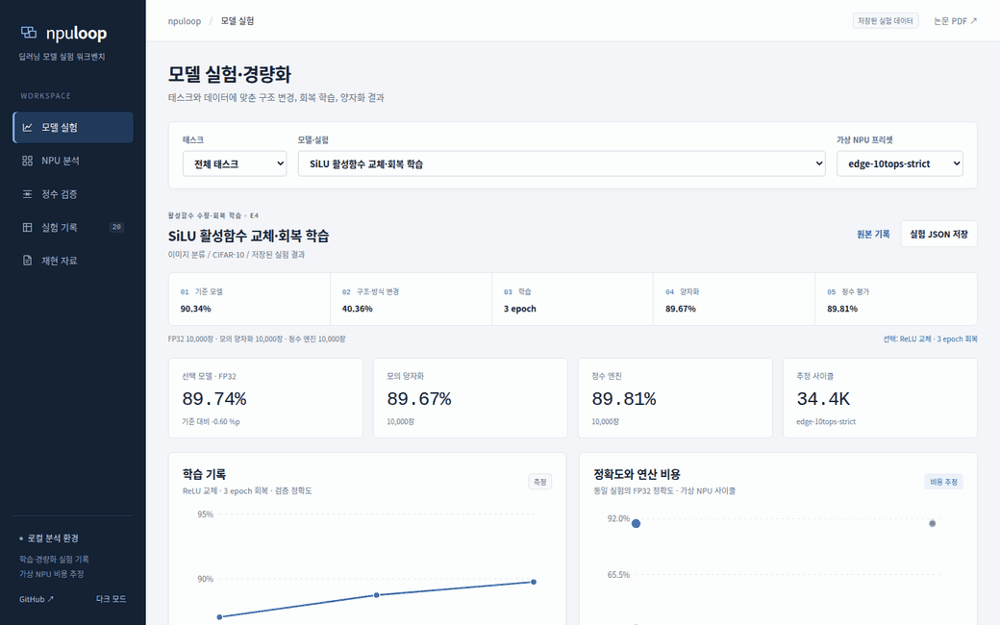

# npuloop — 가상 NPU 제약에 맞춘 모델 변경·학습·경량화

**모델을 NPU의 연산 제약에 맞게 바꾸고, 재학습·양자화·프루닝한 뒤, 비트 정확한 정수 실행까지 직접 확인합니다.**

[](https://github.com/sokldjs554/npuloop/actions/workflows/ci.yml)

> 정확도는 저장된 실험의 **측정값**이고 NPU 사이클은 가상 프리셋의 **추정값**입니다. 실제 칩에서 측정한 값은 없습니다.

## 공개 데모

**Live**: <https://sokldjs554.github.io/npuloop/> — 설치·서버·API 키 없이 열립니다. 로컬은 `docs/index.html`.



52초 · 컷 12장. 저장된 실험 기록을 헤드리스로 실제 조작해 캡처했습니다(`python tools/record_walkthrough.py`).
화면의 모든 숫자에는 **원본 JSON 보기** 버튼이 붙어 있습니다.

## 파이프라인

`PyTorch 모델 → fx IR(BN 접기) → NPU 비용 모델·lint → 프루닝·활성함수 교체 → PTQ/QAT/AdaRound → 정수 export → NumPy ⇄ C++ 비트 대조`

비용 모델이 압축 **루프 안에** 있고, 그 결정을 정수 실행 정확도까지 되돌려 확인하는 것이 이 저장소의 구성입니다.

## 찾은 것

- **정확도가 같다고 텐서가 같지는 않습니다.** 분류 6종 × 양자화 2종에서 모의·정수 정확도 차이는 최대 **0.20%p**였지만 출력 정수 코드의 **28.5–72.7%**가 달랐습니다(E15).
- **원인을 지목하고 제거해 봤습니다.** 가장 큰 국소 원천은 ViT의 LayerNorm(국소 불일치 24.8%)이고, 그것만 정수 산술로 바꿔 국소를 0%로 만들어도 전체 불일치는 **72.7% → 65.7%**까지만 내려갑니다(E16).
- **같은 처방도 칩이 다르면 값이 달라집니다.** GELU→ReLU 교체는 LUT가 있는 프리셋에서 **0.37%**, 없는 프리셋에서 **−32%**. 이 판정을 재학습 **전에** 합니다(E9).
- **음성 결과를 지우지 않았습니다.** AdaRound는 194개 계층 **전부**에서 재구성 오차를 줄였지만 8비트 top-1은 움직이지 않았고(E19), 이 저장소의 비용 모델은 Arm Vela 대비 **5/5 낙관적**입니다(E13).

## 검증 범위

| 무엇을 | 무엇에 대고 | 결과 |
|---|---|---|
| 정수 엔진 | TFLite reference 커널 | 1,000장 × **모든 텐서** 0 불일치 (E11) |
| NumPy 엔진 | C++ 커널 | 모든 중간 텐서 비트 일치 — 테스트가 강제 |
| 비용 모델 | SCALE-Sim v3 | 12개 조합 합계 오차 ≤ 0.08% (E8) |
| 비용 모델 | **Arm Vela**(벤더 추정기) | 5/5 낙관적. 원인의 74.1%가 평균 풀링 (E13) |

각 항목이 **검증하지 않은 것**까지 적은 표는 [docs/VALIDATION_SCOPE.md](docs/VALIDATION_SCOPE.md)에 있습니다.
실제 NPU에서 측정한 적은 없고, E8의 일치는 하드웨어 충실도가 아니라 같은 이상화를 공유하는 두 모델이 같은 식을 같게 구현했다는 확인입니다.

CPU 학습 중 만난 [oneDNN의 1×1 conv backward-weights 오버플로](docs/upstream/onednn_1x1_bwd_weights_rtus_overflow.md)는 benchdnn으로 단독 재현하고 2줄 패치까지 검증해 [uxlfoundation/oneDNN#6035](https://github.com/uxlfoundation/oneDNN/issues/6035)로 보고했습니다.

## 기술 구성

`Python 3.11` · `PyTorch(torch.fx · QAT · AdaRound)` · `NumPy` · `C++17` · `TensorFlow Lite` · `pytest` · `GitHub Actions`

실험 20개(E1–E20) · 가상 NPU 프리셋 4종 · 정수 커널 두 벌(NumPy·C++)과 파이썬 없는 독립 실행기 · fx 의존성 그래프 기반 구조적 프루너 · 브라우저 워크벤치.

## 실행

```bash
git clone https://github.com/sokldjs554/npuloop && cd npuloop && pip install -e .[dev]
make quickstart      # intake → quantize/verify → export + C++ 실행기
python -m pytest -q
```

데이터 다운로드도 학습도 없이 **CPU 4코어 1분 안팎**입니다(번들 체크포인트 2개 + CIFAR-10 샘플 1,012장, 6 MB).
CLI는 여섯 동사입니다: `npuloop cost | lint | intake | quantize | export | bench`.
그중 `npuloop quantize`가 fake-quant와 정수 엔진을 **노드별로** 대조하는 명령입니다.

## 문서

- [실험 E1–E20 전문과 표](docs/EXPERIMENTS.md)
- [검증 범위 — 무엇을 검증하지 **않았는가**](docs/VALIDATION_SCOPE.md)
- [장문 연구 원고 32쪽](paper/npuloop_thesis.pdf) (게재된 논문이 아닙니다)
- [설계 · 모듈 · 정수 데이터패스 · 저장소 구조](docs/DESIGN.md)
- [선행 연구와 이 저장소의 위치](docs/RELATED.md) — 조사 결과로 **자기 주장을 정정한 기록** 포함
- [설치 · 학습 · CLI · 실험 재현 · 파이썬 API](docs/USAGE.md)
- [실험 실행기](docs/STUDY_RUNNER.md) · [화면 사용 안내](docs/DEMO_GUIDE.md) · [통합 검증 기록](docs/INTEGRATION_REPORT.md)
- [oneDNN 버그 보고서와 패치](docs/upstream/)

## 범위

가상 NPU입니다. 실제 칩의 컴파일러(fusion·타일링·메모리 스케줄링)와 다르고, 비용 모델은 dense GEMM 사이클만 외부 대조했습니다.
주 평가는 CIFAR-10 5종·Imagenette 1종·초해상 2종이며, ImageNet 규모 결과(E20)는 ImageNet-1k 검증 정확도가 아닙니다.
혼합 정밀도는 없고(INT8 고정), 프루닝 대상은 residual 밖의 내부 채널뿐이며, CLE의 이득은 이 체크포인트들에서 보이지 못했습니다.
체크포인트를 바꾸면 결론 일부가 흔들립니다 — E3의 레이어 수준 상관과 E7의 3비트 곱셈기 손실이 재학습 후 달라졌습니다.
항목별 근거와 나머지 한계는 [docs/EXPERIMENTS.md](docs/EXPERIMENTS.md)의 해당 실험 절에 있습니다.

데이터: CIFAR-10 (Krizhevsky, 2009) · Imagenette (fast.ai). SCALE-Sim은 E8, ethos-u-vela는 E13 검증에서만 씁니다.
