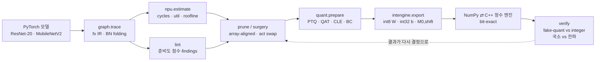

# npuloop — NPU 비용 모델과 비트 정확 정수 엔진으로 닫는 모델 압축 루프

> **"INT8 NPU에 올릴 모델의 양자화·프루닝·활성함수 선택을, FLOPs와 fake-quant가 아니라
> 가상 NPU 비용 모델과 비트 정확(bit-exact) 정수 추론 엔진에 대고 검증한다."**
>
> 해석적 systolic-array 비용 모델(`npu`) → 정적 준비도 lint(`lint`) → NPU 방식 양자화·QAT·CLE·활성함수 교체(`quant`)
> → PE-array 정렬 구조적 프루닝(`prune`) → int8 가중치/int32 바이어스/고정소수점 requant로 export한 정수 그래프를
> NumPy와 C++ 커널로 **비트 단위로 같게** 실행하고 fake-quant와 비교(`intengine`)하는 한 저장소입니다.
> CIFAR-10에서 ResNet-20 계열 4종과 MobileNetV2로 7개 실험(E1–E7)을 돌려 결과를 JSON으로 남겼고, 그 JSON을 읽는
> [인터랙티브 데모](#데모)가 있습니다.

<!-- RESULTS_SUMMARY -->

## 왜 이 프로젝트를 했나

이전 프로젝트들([ondevice-pcb-inspection](https://github.com/sokldjs554/ondevice-pcb-inspection), [edgesight-soc](https://github.com/sokldjs554/edgesight-soc))에서
PTQ INT8 배포와 RTL NPU를 각각 만들어 보고 나니, 두 세계 사이에 구멍이 하나 보였습니다.

* **모델 쪽**은 `torch.round`로 흉내 낸 fake-quant 정확도와 FLOPs로 결정을 내리고,
* **하드웨어 쪽**은 int32 누산기·고정소수점 requant·배열 타일링으로 실제 사이클과 실제 정확도를 만듭니다.

둘 사이의 차이를 개인 프로젝트 수준에서 정량화한 저장소는 찾지 못했습니다(조사 내용은 [docs/RELATED.md](docs/RELATED.md)).
"fake-quant가 90%라고 하면 NPU에서도 90%인가?", "FLOPs를 반으로 줄이면 사이클도 반이 되는가?",
"SiLU를 ReLU로 바꾸면 무엇을 얻고 잃는가?"에 **숫자로** 답하는 것이 목표였습니다.

## 폐루프 구조



<!-- SECTIONS -->

## 저장소 구조

```
npuloop/
├── graph/ir.py          torch.fx → StaticGraph (BN folding, shape 전파, 미지원 op 즉시 실패)
├── npu/spec.py, cost.py 가상 NPU 프리셋 4종 + weight-stationary systolic 비용 모델 (멀티코어 M/N 분할, DW 엔진, LUT/폴백, DRAM roofline)
├── lint/checks.py       정적·동적 준비도 점검 → efficiency / quant-robustness 점수
├── quant/               관측기(minmax·percentile·MSE), fake-quant(STE·LSQ), NPU식 삽입(prepare), 캘리브레이션, CLE, 바이어스 보정, 민감도, 활성함수 교체, QAT
├── intengine/           IntGraph export, gemmlowp/TFLite 동일 requant, NumPy 엔진, C++ 커널(ctypes), fake-vs-int 검증
├── prune/structured.py  채널 프루닝: uniform · aligned · cost-greedy(비용 모델 in-the-loop)
├── zoo/                 CIFAR-10 npz 로더, 모델, 재현 가능한 트레이너(resume)
└── cli.py               npuloop cost | lint | quantize
experiments/             E1–E7 스크립트 (재개 가능, results/*.json에 provenance 라벨과 함께 저장)
results/                 실험 결과 JSON
demo/                    build.py + index.template.html → 인라인 JSON 데모 페이지 (docs/index.html)
tests/                   pytest 44개 (참조 구현 대조, 비트 동일성, 정확성 회귀)
docs/                    DESIGN.md · INTEGER_DATAPATH.md · RELATED.md
```

## 빠른 시작

```bash
pip install -e .[dev]           # torch(CPU), numpy, pytest
python -m pytest -q             # 44 tests, ~5 s (C++ 커널은 첫 실행 때 g++로 컴파일)

# CIFAR-10 (npz 한 파일) 준비: tools/prepare_cifar10.py 참고
python -m npuloop.zoo.train --arch resnet --act relu --epochs 30 --out runs/resnet20_relu --data data/cifar10.npz

npuloop cost runs/resnet20_relu/best.pt --spec edge-10tops          # 레이어별 사이클/활용률 표
npuloop lint runs/resnet20_relu/best.pt --spec edge-10tops --data data/cifar10.npz
npuloop quantize runs/resnet20_relu/best.pt --data data/cifar10.npz --scheme npu-default --verify 500 --int-eval 2000

bash experiments/run_all.sh     # E1–E7 전부 (CPU 4코어 기준 수 시간), results/*.json
python demo/build.py            # results → demo/index.html, docs/index.html
```

파이썬 API 한 줄 요약:

```python
from npuloop.zoo import load_checkpoint, CIFAR10NPZ
from npuloop.graph import trace
from npuloop.npu import estimate
from npuloop.lint import lint
from npuloop.quant import prepare, calibrate, evaluate, QScheme
from npuloop.intengine import export_int_graph, NumpyEngine
from npuloop.intengine.cpp_engine import CppEngine
from npuloop.intengine.verify import compare, agreement_table

m = load_checkpoint("runs/resnet20_relu/best.pt"); ds = CIFAR10NPZ("data/cifar10.npz")
print(estimate(trace(m), "edge-10tops").table())                     # simulated cycles
print(lint(trace(m), "edge-10tops", ds.calib_batch(64).numpy()).markdown())
qm = prepare(m, QScheme()); calibrate(qm, [ds.calib_batch(256)])
ig = export_int_graph(qm)                                             # int8/int32/M0,shift
rows, summary = compare(qm, ig, ds.calib_batch(200)); print(agreement_table(rows), summary)
print(NumpyEngine(ig).evaluate(ds, limit=2000), CppEngine(ig).evaluate(ds, limit=2000))
```


## 설계에서 신경 쓴 것들

* **양자화 지점이 NPU 데이터패스와 1:1.** ReLU 계열은 requant clamp에 융합되므로 활성함수 뒤에만 양자화기가 있고, SiLU/GELU/HardSwish는 int8 LUT라서 **활성함수 앞에 양자화기가 하나 더** 들어갑니다. avgpool 출력은 입력 스케일에 묶입니다(TFLite와 동일). "ReLU 모델이 INT8에 강하다"는 통념의 기계적 이유가 코드에 그대로 있습니다 ([docs/INTEGER_DATAPATH.md](docs/INTEGER_DATAPATH.md)).
* **정수 산술은 참조 구현과 비트 동일.** `SaturatingRoundingDoublingHighMul`, `RoundingDivideByPOT`, TFLite add의 20비트 left-shift, avgpool의 half-away 반올림을 그대로 구현하고, 스칼라 gemmlowp 참조와 랜덤 테스트로 대조합니다. NumPy 엔진과 C++ 커널은 **모든 중간 텐서**가 같아야 테스트가 통과합니다.
* **비용 모델은 시뮬레이터로 검증.** weight-stationary 타일당 `M + 2R + C − 2` 사이클 모델이 SCALE-Sim v3의 사이클 정확 결과와 레이어당 0.5% 이내(합계 0.03%)로 일치합니다(E8). 처음 만든 `M + R + C` 모델은 10–13% 낙관적이었고, 이 차이를 SCALE-Sim으로 찾아 고쳤습니다.
* **불일치를 두 관점으로 분리.** fake-quant와 정수 엔진의 차이를 "국소(각 op에 fake-quant 코드를 먹였을 때)"와 "전파(끝까지 정수로 실행)"로 나눠 재서, ±1 LSB의 국소 오차가 어떻게 누적되고 최종 정확도에는 왜 거의 영향이 없는지 보입니다.
* **재현 가능성과 출처 라벨.** 학습·프루닝·QAT는 시드 고정·재개 가능(`state.pt`)이고, 실험 JSON의 모든 레코드에 `provenance: measured | simulated` 라벨이 붙습니다. 프리셋 NPU는 공개 헤드라인 수치에 맞춘 **가정**이며 특정 벤더의 실제 구조가 아님을 코드와 문서에 명시했습니다.
* **테스트가 실제 버그를 잡았습니다.** 프루닝으로 새로 만든 BatchNorm이 eval 모드를 물려받지 않아 배치 통계로 평가되던 버그, half-even 반올림의 shift=0 예외, per-tensor 서브셋 평가가 클래스 순서로 정렬된 테스트셋 때문에 편향되던 문제를 모두 테스트/실험 단계에서 발견해 고쳤습니다(커밋 이력 참고).

## 한계와 다음 단계

* **CIFAR-10, 30 epoch, seed 1개.** 정확도 차이 0.2%p 이하는 잡음입니다(10k 이미지 표준오차 ≈ 0.3%p). 결론은 "방향"이지 소수점 둘째 자리가 아닙니다.
* **가상 NPU.** 실제 칩의 컴파일러(fusion, 타일링, 메모리 스케줄링)와 다릅니다. 비용 모델은 연산 사이클은 검증했지만 DRAM/SRAM 모델은 1차 근사(roofline)입니다. 실제 NPU 보드가 생기면 같은 IntGraph를 올려 정확도·지연을 대조하는 것이 첫 번째 할 일입니다.
* **지원 op가 좁습니다.** conv/dw-conv/linear/add/global-avgpool/elementwise 활성함수만. concat·upsample·attention은 `UnsupportedOpError`로 즉시 실패시킵니다(조용히 넘어가지 않기 위해). 검출 헤드(DFL, NMS)까지 정수로 옮기는 것이 다음 단계입니다.
* **프루닝 대상이 residual 밖의 내부 채널뿐**이라 절감 폭에 상한이 있습니다. residual stream 채널을 같이 자르려면 의존성 그래프가 필요합니다.
* **혼합 정밀도 없음.** 이 프로젝트의 NPU는 INT8 고정이라 비트 폭 탐색 대신 정수 구현 세부(E7)에 집중했습니다.

## 라이선스

[Apache License 2.0](LICENSE). 데이터: CIFAR-10 (Krizhevsky, 2009). SCALE-Sim은 검증 실험에서만 사용합니다(MIT).

