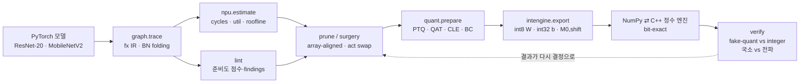

# npuloop — NPU 비용 모델과 비트 정확 정수 엔진으로 닫는 모델 압축 루프

> **"INT8 NPU에 올릴 모델의 양자화·프루닝·활성함수 선택을, FLOPs와 fake-quant가 아니라
> 가상 NPU 비용 모델과 비트 정확(bit-exact) 정수 추론 엔진에 대고 검증한다."**
>
> 해석적 systolic-array 비용 모델(`npu`) → 정적 준비도 lint(`lint`) → NPU 방식 양자화·QAT·CLE·활성함수 교체(`quant`)
> → PE-array 정렬 구조적 프루닝(`prune`) → int8 가중치/int32 바이어스/고정소수점 requant로 export한 정수 그래프를
> NumPy와 C++ 커널로 **비트 단위로 같게** 실행하고 fake-quant와 비교(`intengine`)하는 한 저장소입니다.
> CIFAR-10에서 ResNet-20 계열 4종과 MobileNetV2로 7개 실험(E1–E7)을 돌려 결과를 JSON으로 남겼고, 그 JSON을 읽는
> [인터랙티브 데모](#데모)가 있습니다.

<!-- RESULTS_SUMMARY -->

## 왜 이 프로젝트를 했나

이전 프로젝트들([ondevice-pcb-inspection](https://github.com/sokldjs554/ondevice-pcb-inspection), [edgesight-soc](https://github.com/sokldjs554/edgesight-soc))에서
PTQ INT8 배포와 RTL NPU를 각각 만들어 보고 나니, 두 세계 사이에 구멍이 하나 보였습니다.

* **모델 쪽**은 `torch.round`로 흉내 낸 fake-quant 정확도와 FLOPs로 결정을 내리고,
* **하드웨어 쪽**은 int32 누산기·고정소수점 requant·배열 타일링으로 실제 사이클과 실제 정확도를 만듭니다.

둘 사이의 차이를 개인 프로젝트 수준에서 정량화한 저장소는 찾지 못했습니다(조사 내용은 [docs/RELATED.md](docs/RELATED.md)).
"fake-quant가 90%라고 하면 NPU에서도 90%인가?", "FLOPs를 반으로 줄이면 사이클도 반이 되는가?",
"SiLU를 ReLU로 바꾸면 무엇을 얻고 잃는가?"에 **숫자로** 답하는 것이 목표였습니다.

## 폐루프 구조




## 실험 결과 (CIFAR-10, seed 0, CPU 4코어)

숫자는 전부 `results/*.json`에서 `tools/readme_tables.py --inject README.md`로 생성한 것입니다. 정확도는 test 10,000장 기준이며,
`simulated`로 표시한 사이클·활용률은 가상 NPU 비용 모델 값입니다.

### E1. 베이스라인과 정적 분석

같은 학습 레시피(30 epoch OneCycle SGD)로 훈련한 3개 모델을 가상 NPU 프리셋에 올렸을 때의 사이클과 lint 점수입니다.
ResNet-20의 16/32 채널은 64폭 배열의 열을 1/4~1/2밖에 채우지 못해 2코어 64×64(edge-10tops)에서 배열 활용률이 14%, 8코어(pcie-80tops)에서는 5%까지 떨어지고, 32×32 배열(tiny-1tops)에서는 45%로 올라갑니다.
지연 시간은 큰 NPU가 짧지만 실리콘의 대부분이 놀고 있다는 뜻이고, "작은 모델에는 큰 배열이 낭비"라는 것이 첫 번째 관찰입니다.
SiLU 모델은 strict 프리셋(LUT 없음, 호스트 폴백)에서 사이클이 45배로 뛰고 lint의 효율성·강건성 점수가 모두 떨어집니다.

<!-- TABLE:E1 -->
| 모델 | 파라미터 | MACs | FP32 acc | tiny-1tops cycles (util) | edge-10tops cycles (util) | pcie-80tops cycles (util) | lint eff / q-rob |
|---|---|---|---|---|---|---|---|
| ResNet-20 ReLU | 272,474 | 40.8M | 90.47% | 87,730 (45%) | 34,417 (14%) | 22,791 (5%) | 80 / 97 |
| ResNet-20 SiLU | 272,474 | 40.8M | 90.49% | 90,674 (44%) | 34,785 (14%) | 22,817 (5%) | 72 / 75 |
| MobileNetV2-0.5 ReLU6 | 700,490 | 28.0M | 90.97% | 200,536 (12%) | 87,056 (3%) | 67,351 (1%) | 77 / 98 |
<!-- /TABLE:E1 -->

### E8. 비용 모델은 믿을 만한가 — SCALE-Sim 대조

해석적 모델의 연산 사이클을 SCALE-Sim v3(사이클 정확 systolic 시뮬레이터, WS dataflow, 대역폭 제한 없음)와 레이어별로 비교했습니다.
처음 만든 모델(타일당 `M + R + C`)은 10~13% 낙관적이었고, SCALE-Sim의 per-fold 사이클을 뜯어보니 가중치 타일을 배열에 싣는 `R` 사이클이 빠져 있었습니다.
`M + 2R + C − 2`로 고친 뒤에는 세 배열 크기 모두에서 합계 0.03%, 최악 레이어 0.5%(FC의 off-by-one) 이내입니다.

<!-- TABLE:E8 -->
| 모델 | 배열 | SCALE-Sim cycles | npuloop cycles | 비율 | 최악 레이어 오차 | fill/drain 없이 |
|---|---|---|---|---|---|---|
| ResNet-20 ReLU | 32×32 | 84,276 | 84,298 | 1.0003 | 0.5% | 0.683 |
| ResNet-20 ReLU | 64×64 | 49,123 | 49,145 | 1.0004 | 0.5% | 0.614 |
| ResNet-20 ReLU | 16×16 | 208,486 | 208,508 | 1.0001 | 0.5% | 0.766 |
<!-- /TABLE:E8 -->

### E2. PTQ 스킴 그리드 — fake-quant는 정수 엔진을 얼마나 잘 예측하는가

같은 512장 캘리브레이션으로 7개 스킴을 적용한 뒤 (a) PyTorch fake-quant 정확도, (b) 같은 파라미터를 int8 가중치·int32 바이어스·고정소수점 requant로 export해 **비트 정확 정수 엔진**으로 돌린 정확도를 따로 쟀습니다.

<!-- TABLE:E2 -->
**(A) fake-quant 정확도 (test 10,000장)**

| 모델 (FP32) | npu-default | npu-percentile | npu-mse | per-tensor | per-tensor-mse | pow2 | sym-act |
|---|---|---|---|---|---|---|---|
| ResNet-20 ReLU (90.47%) | 90.51% (+0.04%p) | 90.52% (+0.05%p) | 90.50% (+0.03%p) | 90.52% (+0.05%p) | 90.50% (+0.03%p) | 90.53% (+0.06%p) | 90.70% (+0.23%p) |
| ResNet-20 SiLU (90.50%) | 90.45% (-0.05%p) | 90.47% (-0.03%p) | 90.58% (+0.08%p) | 90.46% (-0.04%p) | 90.60% (+0.10%p) | 90.19% (-0.31%p) | 90.27% (-0.23%p) |
| MobileNetV2-0.5 ReLU6 (91.01%) | 90.92% (-0.09%p) | 90.95% (-0.06%p) | 91.02% (+0.01%p) | 91.05% (+0.04%p) | 91.00% (-0.01%p) | 90.91% (-0.10%p) | 91.04% (+0.03%p) |

**(B) 비트 정확 정수 엔진 vs fake-quant — 같은 이미지에서**

| 모델 | 스킴 | 이미지 수 | fake-quant | 정수 엔진 | 차이 | top-1 일치 (500장) | 출력 코드 불일치 | 첫 분기 |
|---|---|---|---|---|---|---|---|---|
| ResNet-20 ReLU | npu-default | 10,000 | 90.51% | 90.48% | -0.03%p | 99.2% | 46% | stem_conv |
| ResNet-20 ReLU | npu-percentile | 2,000 | 90.85% | 90.85% | +0.00%p | 99.8% | 31% | stem_conv |
| ResNet-20 ReLU | npu-mse | 2,000 | 90.75% | 90.70% | -0.05%p | 99.6% | 37% | stem_conv |
| ResNet-20 ReLU | per-tensor | 10,000 | 90.52% | 90.52% | +0.00%p | 99.4% | 45% | stem_conv |
| ResNet-20 ReLU | per-tensor-mse | 2,000 | 90.80% | 90.90% | +0.10%p | 99.4% | 38% | stem_conv |
| ResNet-20 ReLU | pow2 | 2,000 | 90.55% | 90.90% | +0.35%p | 98.8% | 50% | stem_conv |
| ResNet-20 ReLU | sym-act | 2,000 | 91.00% | 91.05% | +0.05%p | 98.8% | 52% | stem_conv |
| ResNet-20 SiLU | npu-default | 10,000 | 90.45% | 90.42% | -0.03%p | 99.0% | 55% | stem_conv |
| ResNet-20 SiLU | npu-percentile | 2,000 | 90.40% | 90.30% | -0.10%p | 99.4% | 39% | stem_conv |
| ResNet-20 SiLU | npu-mse | 2,000 | 90.70% | 90.50% | -0.20%p | 99.6% | 44% | stem_conv |
| ResNet-20 SiLU | per-tensor | 10,000 | 90.46% | 90.40% | -0.06%p | 98.8% | 54% | stem_conv |
| ResNet-20 SiLU | per-tensor-mse | 2,000 | 90.85% | 90.70% | -0.15%p | 99.2% | 45% | stem_conv |
| ResNet-20 SiLU | pow2 | 2,000 | 89.80% | 90.25% | +0.45%p | 98.0% | 75% | stem_conv |
| ResNet-20 SiLU | sym-act | 2,000 | 90.25% | 90.40% | +0.15%p | 99.0% | 55% | stem_conv |
| MobileNetV2-0.5 ReLU6 | npu-default | 10,000 | 90.92% | 91.08% | +0.16%p | 99.0% | 47% | stem_conv |
| MobileNetV2-0.5 ReLU6 | npu-percentile | 2,000 | 91.10% | 91.10% | +0.00%p | 100.0% | 39% | stem_conv |
| MobileNetV2-0.5 ReLU6 | npu-mse | 2,000 | 91.05% | 91.10% | +0.05%p | 99.6% | 42% | stem_conv |
| MobileNetV2-0.5 ReLU6 | per-tensor | 10,000 | 91.05% | 91.11% | +0.06%p | 99.2% | 50% | stem_conv |
| MobileNetV2-0.5 ReLU6 | per-tensor-mse | 2,000 | 91.10% | 91.35% | +0.25%p | 99.6% | 44% | stem_conv |
| MobileNetV2-0.5 ReLU6 | pow2 | 2,000 | 91.20% | 90.80% | -0.40%p | 97.6% | 77% | stem_conv |
| MobileNetV2-0.5 ReLU6 | sym-act | 2,000 | 91.25% | 91.15% | -0.10%p | 100.0% | 44% | stem_conv |
<!-- /TABLE:E2 -->

관찰:

* **fake-quant는 정확도 예측기로는 충분히 정확합니다.** ResNet-20 ReLU에서 fake 90.51% vs 정수 90.48%, 이미지 단위 top-1 일치 99%대.
* **그러나 텐서 단위로는 전혀 같지 않습니다.** 각 conv의 국소(teacher-forced) 불일치는 0.03~0.2%(±1 LSB)뿐인데, 끝까지 정수로 실행하면 깊은 레이어에서 코드의 15~30%, 최종 로짓의 45%가 달라집니다. ±1 LSB가 다음 레이어의 반올림 결정을 바꾸는 나비효과이고, 분류 결과는 그래도 거의 바뀌지 않습니다. "fake-quant와 하드웨어 결과가 다르다"는 보고를 받으면 먼저 *어느 레이어에서, 국소로, 몇 LSB* 인지 물어야 하는 이유입니다.
* **국소 불일치의 출처**: conv/linear(고정소수점 곱셈기 + 바이어스 반올림), avgpool(half-away vs half-even 타이), pow2 스킴의 add(정확한 .5 타이). TFLite식 add(20비트 left-shift)는 일반 스킴에서 국소 불일치가 0입니다.
* **SiLU 모델(LUT 활성함수)도 PTQ에 강합니다.** FP32 90.50% → npu-default 90.45%, 정수 엔진 90.42%. LUT 노드의 국소 불일치는 정확히 0(테이블 조회는 fake-quant의 "양자화→활성함수→양자화"와 동일한 함수)이고, 레이어당 양자화 지점이 하나 더 있어도 정확도는 ReLU 모델과 같습니다. lint가 SiLU 모델의 양자화 강건성 점수를 75점으로 깎은 것은 **이 네트워크에서는 과한 경고**였습니다(E3에서 다시 다룹니다). 다만 pow2·sym-act처럼 스케일에 제약을 두는 스킴에서는 SiLU 모델이 0.3%p 정도 더 잃습니다. SiLU의 진짜 비용은 정확도가 아니라 **효율성**(strict NPU에서 45배 사이클)입니다.
* **MobileNetV2-0.5도 7개 스킴 전부에서 ±0.1%p 안입니다.** depthwise·6배 확장 채널이 있어도 per-tensor 가중치(91.05%)가 per-channel(90.92%)보다 나쁘지 않습니다 — E4(a)·E3에서 이유를 다룹니다. 정수 엔진은 대부분의 스킴에서 fake-quant보다 오히려 0.05~0.25%p 높고, 유일한 예외가 pow2(정수 −0.40%p, top-1 일치 97.6%, 출력 코드 불일치 77%)입니다. 2의 거듭제곱 스케일은 residual add의 requant에서 정확한 .5 타이를 만들고, fake-quant(half-even)와 정수 엔진(half-away)이 이 타이를 다르게 반올림해 불일치가 누적됩니다. 정확도 예측기로서 fake-quant가 가장 못 믿을 만한 곳이 바로 이 "타이가 많은 스킴"입니다.
* **`sym-act`(대칭 int8 활성값)는 처음 실행에서 정수 엔진 정확도가 9%로 무너졌습니다.** "requant clamp가 곧 ReLU"라는 가정이 `qmin=-127`에서는 틀리기 때문입니다. fake-quant만 보면 절대 안 보이는 버그를 정수 엔진이 잡았고, export 단계에서 노드별 clamp 하한을 `zp`로 명시하도록 고쳤습니다 ([docs/INTEGER_DATAPATH.md](docs/INTEGER_DATAPATH.md)).

### E7. 정수 구현 세부의 정확도 비용

양자화 파라미터는 그대로 두고 정수 엔진의 구현만 바꿨습니다. 기준 구현(gemmlowp 이중 반올림, Q31 곱셈기, int32 누산기·바이어스)과의 **이미지 단위 top-1 일치율**은 시드 잡음이 없는 지표입니다.

<!-- TABLE:E7 -->
| RequantConfig | ResNet-20 ReLU: acc / 기준 대비 top-1 일치 | ResNet-20 SiLU: acc / 기준 대비 top-1 일치 | MobileNetV2-0.5 ReLU6: acc / 기준 대비 top-1 일치 |
|---|---|---|---|
| `tflite-m31-acc32-b32` | 91.00% / 100.0% | 90.45% / 100.0% | 91.35% / 100.0% |
| `single-m31-acc32-b32` | 91.00% / 99.4% | 90.35% / 99.1% | 91.00% / 99.2% |
| `half_even-m31-acc32-b32` | 90.85% / 99.4% | 90.45% / 99.1% | 90.95% / 99.5% |
| `truncate-m31-acc32-b32` | 89.30% / 95.2% | 88.55% / 93.4% | 89.45% / 93.8% |
| `floor-m31-acc32-b32` | 88.65% / 94.0% | 89.00% / 93.9% | 89.60% / 94.8% |
| `tflite-m15-acc32-b32` | 90.85% / 99.4% | 90.60% / 98.9% | 90.95% / 99.5% |
| `tflite-m7-acc32-b32` | 90.80% / 99.0% | 90.45% / 98.8% | 90.95% / 99.0% |
| `tflite-m3-acc32-b32` | 89.70% / 95.6% | 89.45% / 94.2% | 89.05% / 93.8% |
| `tflite-m31-acc32-b16` | 82.85% / 86.2% | 90.40% / 97.4% | 90.90% / 98.9% |
| `tflite-m31-acc32-b12` | 9.75% / 10.0% | 13.75% / 13.7% | 11.20% / 11.8% |
| `tflite-m31-acc24-b32` | 91.00% / 100.0% | 90.45% / 100.0% | 91.35% / 100.0% |
| `tflite-m31-acc20-b32` | 91.00% / 100.0% | 90.45% / 100.0% | 91.25% / 99.9% |
| `tflite-m31-acc16-b32` | 52.80% / 54.4% | 63.00% / 65.0% | 15.50% / 15.2% |

2000장 기준. 기준 구현은 `tflite-m31-acc32-b32`(gemmlowp 이중 반올림). 곱셈기 비트·누산기 폭이 줄어들 때 무엇이 먼저 무너지는지 보세요.
<!-- /TABLE:E7 -->

세 모델(ResNet-20 ReLU/SiLU, MobileNetV2)에서 순위가 똑같이 나옵니다.

* **반올림 모드**: TFLite single rounding과 half-even은 기준(gemmlowp 이중 반올림)과 99%대로 일치하고 정확도 차이는 잡음 수준입니다. **truncate/floor는 일치율이 93~95%로 떨어지고 1.5~2.3%p를 잃습니다.** requant에서 "그냥 시프트"는 공짜가 아닙니다.
* **곱셈기 비트**: 15비트까지는 손실이 없고(99.4%), 7비트에서 99.0%, **3비트(사실상 2의 거듭제곱 곱셈기)에서 95.6%, −1.2%p** — 스케일을 2의 거듭제곱으로 제한하는 NPU라면 QAT 때 그 제약을 같이 학습시켜야 하는 근거입니다.
* **바이어스 폭이 가장 위험합니다.** 바이어스는 `s_in·s_w[c]` 단위의 정수라 값이 크고, int16으로 자르면 **−8.2%p(일치율 86%)**, int12면 모델이 무너집니다(9.8%). 포화 카운터는 0인데 정확도가 떨어지는 이유는 포화가 바이어스 양자화 시점(export)에 일어나기 때문입니다.
* **누산기 폭**: int24·int20은 포화 0회(MobileNetV2의 int20만 소수)에 기준과 100% 일치 — ResNet-20의 K=576 레이어도 실제 누산값은 20비트 안에 듭니다. **int16은 ResNet-20에서 1,070만 회 포화하며 52.8%로, MobileNetV2에서는 15.5%로 붕괴**합니다. "최악 케이스 K·127·255 = 25비트"라는 정적 계산과 실제 분포(20비트) 사이의 여유를 이렇게 숫자로 볼 수 있습니다.

### E3. 정적 lint는 실제 손실을 예측하는가

lint의 `weight-range-disparity` 검사는 BN folding 후 채널별 가중치 범위의 max/median 비율(데이터 없이 계산)로 per-tensor 양자화 위험을 경고합니다. 이 신호가 실제 손실과 상관이 있는지, 3개 모델 97개 레이어에서 **그 레이어의 가중치만** 양자화했을 때의 Δloss(E2의 감도 분석)와 비교했습니다.

* **per-tensor에서는 예측하고, per-channel에서는 예측하지 않습니다 — 둘 다 의도대로입니다.** per-tensor 가중치 양자화의 레이어별 Δloss와 범위 비율의 Spearman ρ = 0.41(n = 97, p < 10⁻⁴). 같은 신호를 per-channel(npu-default) 손실과 비교하면 ρ = −0.07 — per-channel 스케일이 이 검사가 경고하는 메커니즘 자체를 없애기 때문입니다. 검사는 "주장하는 것을 측정"하고 있습니다.
* **다만 절대 손실은 어느 레이어도 크지 않습니다.** 최대 범위 비율이 3.5배(MobileNetV2 `blocks.0.dw_conv`)라 최악 레이어의 Δloss도 0.0014입니다. lint가 medium/high 경고를 낼 만한 레이어(수십~수백 배)가 이 모델들에는 없고, E4(a)에서 CLE가 이득이 없던 것과 같은 이유입니다.
* **모델 수준에서는 순서는 맞지만 크기는 과장돼 있습니다.** lint의 quant-robustness는 ReLU 97 / SiLU 75 / MobileNetV2 98인데, 스킴 전체(7개) 평균 정수 손실은 −0.30 / +0.18 / −0.06%p입니다. SiLU가 가장 약하다는 방향은 맞지만 22점 차이가 0.3~0.5%p에 해당합니다 — LUT 활성함수에 매기는 12점 감점은 CIFAR 규모의 활성값 범위에서는 과합니다. 점수는 **순위용(ordinal)**이지 손실 예측기(calibrated)가 아니며, 모델이 3개라 통계도 낼 수 없습니다. 더 많은 모델의 측정 손실에 회귀시켜 가중치를 보정하는 것이 다음 단계입니다.

<!-- TABLE:E3 -->
**(a) 레이어 수준** — 한 레이어의 가중치만 양자화했을 때의 Δloss vs lint의 정적 채널 범위 비율(BN folding 후 max/median)

| 가중치 스킴 | 레이어 수 | Spearman ρ (범위 비율 vs Δloss) | Spearman ρ (범위 비율 vs −SQNR) |
|---|---|---|---|
| per-tensor | 97 | 0.41 | 0.15 |
| npu-default | 97 | -0.07 | -0.46 |

**(b) 모델 수준** — lint 점수(edge-10tops) vs E2에서 측정한 FP32 대비 손실(%p; 양수 = 손실)

| 모델 | lint q-rob | lint eff | 스킴 수 | 평균 손실 fake / int | 최악 int 손실 |
|---|---|---|---|---|---|
| ResNet-20 ReLU | 97 | 80 | 7 | -0.07 / -0.30 | -0.01 |
| ResNet-20 SiLU | 75 | 72 | 7 | +0.07 / +0.18 | +0.40 |
| MobileNetV2-0.5 ReLU6 | 98 | 77 | 7 | +0.03 / -0.06 | +0.25 |

모델 수준 Spearman(−q-rob vs fake 손실, per-tensor, n = 3): 0.50

모델 수준 Spearman(−q-rob vs fake 손실, npu-default, n = 3): -0.50
<!-- /TABLE:E3 -->

### E4. 수술: CLE · 바이어스 보정 · 활성함수 교체 · QAT

(b) **활성함수 교체가 가장 싼 수술입니다.** ResNet-20-SiLU(FP32 90.50%)의 SiLU 19개를 ReLU로 바꾸면 재학습 없이는 54%로 무너지지만, **3 epoch만 healing하면 90.0%(INT8 정수 엔진 90.0%)**로 돌아옵니다. HardSwish로 바꾸면 SiLU와 모양이 비슷해서 **재학습 없이도 89.6%**, 3 epoch healing 후 **90.2%(정수 엔진 90.1%)**로 SiLU 원본과 사실상 같습니다. 대가로 얻는 것: LUT가 없는 strict NPU에서 사이클 **1,554,865 → 34,417 (45배)**, LUT가 있는 NPU에서도 LUT 사이클 1%가 사라집니다. "SiLU를 NPU가 지원하나요?"라는 질문에 대한 답은 "지원 여부보다, 3 epoch 재학습으로 ReLU가 되는지 먼저 보라"입니다.
(a) **MobileNetV2 per-tensor 실험은 "실패를 재현하지 못한" 정직한 결과입니다.** 논문(DFQ)에서 per-tensor 가중치가 MobileNetV2를 무너뜨리는 이유는 BN folding 후 depthwise 채널 범위가 수십~수백 배 벌어지기 때문인데, 이 저장소의 CIFAR MobileNetV2-0.5(BN 파라미터에 weight decay 없음, 30 epoch)는 **최대 비율이 3.5배**뿐입니다. lint는 이 모델의 양자화 강건성을 98점으로 매겨 "per-tensor로도 괜찮다"고 예측했고, 측정도 그랬습니다(per-tensor PTQ 91.05%, FP32 91.01%). CLE는 필요 없는 수술이었고 ReLU6→ReLU 치환 때문에 0.2%p를 오히려 잃었습니다. 정적 lint가 **"고치지 말라"**고 말해 주는 것도 값이 있다는 예입니다. CLE의 이득을 보려면 ImageNet 계열의 죽은 채널이 있는 체크포인트가 필요하며, 이는 한계로 남깁니다.
(c) 각 모델의 짧은 QAT(2 epoch × 250 step, lr 0.002)는 아래 표에 있습니다. PTQ 손실이 이미 0.1%p 이하인 모델에 짧은 QAT를 얹으면 얻을 것이 거의 없습니다 — QAT는 PTQ가 실제로 무너지는 곳에서만 값을 합니다. 부수적으로 배운 것: **BN을 접은 모델의 QAT는 학습률에 민감합니다.** lr 0.005에서는 ReLU ResNet-20이 40 step 안에 발산했고(정규화 층이 남아 있지 않기 때문), 0.002에서는 안정적이었습니다. 그래서 모든 QAT를 0.002로 다시 돌렸습니다.

<!-- TABLE:E4 -->
**(a) MobileNetV2-0.5, per-tensor 가중치 NPU 가정**

| 단계 | fake-quant | 정수 엔진 |
|---|---|---|
| ptq | 91.05% | 91.11% |
| cle | 90.80% | 90.84% |
| cle+bc | 90.88% | 90.94% |
| bc | 91.02% | 91.03% |
| cle+qat | 90.98% | 90.98% |

**(b) ResNet-20-SiLU 활성함수 교체 + healing**

| 변형 | FP32 (교체 직후 → heal 후) | INT8 fake / int | edge-10tops cycles | strict NPU cycles |
|---|---|---|---|---|
| silu-ptq | 90.50% | 90.45% / 90.42% | 34,785 | 1,554,865 |
| swap-relu-heal0 | 53.96% → 53.96% | 53.25% / 53.18% | 34,417 | 34,417 |
| swap-relu-heal3 | 53.96% → 90.02% | 90.04% / 90.09% | 34,417 | 34,417 |
| swap-hswish-heal0 | 89.58% → 89.58% | 89.65% / 89.75% | 34,785 | 1,554,865 |
| swap-hswish-heal3 | 89.58% → 90.19% | 90.12% / 90.03% | 34,785 | 1,554,865 |
| silu-qat | 90.50% | 90.26% / 90.19% | 34,785 | 1,554,865 |

**(c) PTQ → QAT (3 epochs)**

| 모델 | 스킴 | FP32 | PTQ | QAT fake | QAT int | QAT 이득 |
|---|---|---|---|---|---|---|
| ResNet-20 ReLU | npu-default | 90.47% | 90.51% | 90.01% | 90.18% | -0.50%p |
| MobileNetV2-0.5 ReLU6 | npu-default | 91.01% | 90.92% | 91.00% | 90.87% | +0.08%p |
<!-- /TABLE:E4 -->

### E5. 캘리브레이션 세트는 몇 장이면 되는가

이미지 수 8 → 2048, 무작위 vs 클래스 균형, 시드 3개. 표의 값은 FP32 대비 손실(%p)의 시드 평균 ± 표준편차입니다.

* **ResNet-20 ReLU는 8장이면 끝납니다.** per-channel·per-tensor 모두 모든 크기에서 손실이 ±0.15%p 안에 있고 시드 편차는 0.1%p 이하 — BN folding 후 ReLU 출력의 min-max 범위는 몇 장만 봐도 안정됩니다. 클래스 균형 샘플링도 이득이 없습니다.
* **MobileNetV2도 마찬가지입니다.** depthwise·6배 확장 채널이 있어도 8장과 2048장의 차이가 0.1%p 안에 들어옵니다.
* 즉, 이 두 모델에서 "캘리브레이션 세트를 키우면 좋아진다"는 통념은 **측정으로는 지지되지 않습니다.** min-max 관측기가 실패하는 조건(긴 꼬리 outlier, 스케일이 큰 검출 헤드)은 CIFAR 분류 모델에는 없었습니다. lint가 outlier 경고를 낸 텐서들도 percentile/MSE 관측기로 얻는 이득이 0.0~0.1%p였습니다(E2).

<!-- TABLE:E5 -->
| 모델 | 스킴 | 샘플링 | 8 | 32 | 128 | 512 | 2048 |
|---|---|---|---|---|---|---|---|
| ResNet-20 ReLU | npu-default | 무작위 | -0.02 ± 0.07 | 0.00 ± 0.03 | 0.01 ± 0.04 | 0.02 ± 0.07 | -0.01 ± 0.10 |
| ResNet-20 ReLU | npu-default | 균형 | — | 0.02 ± 0.05 | 0.01 ± 0.06 | -0.00 ± 0.10 | -0.01 ± 0.08 |
| ResNet-20 ReLU | per-tensor | 무작위 | -0.11 ± 0.04 | -0.10 ± 0.04 | -0.14 ± 0.06 | -0.04 ± 0.04 | -0.08 ± 0.05 |
| ResNet-20 ReLU | per-tensor | 균형 | — | -0.09 ± 0.00 | -0.14 ± 0.02 | -0.09 ± 0.03 | -0.12 ± 0.02 |
| MobileNetV2-0.5 ReLU6 | npu-default | 무작위 | -0.05 ± 0.05 | 0.04 ± 0.06 | -0.01 ± 0.02 | 0.05 ± 0.03 | 0.00 ± 0.03 |
| MobileNetV2-0.5 ReLU6 | npu-default | 균형 | — | -0.00 ± 0.04 | -0.02 ± 0.04 | 0.01 ± 0.07 | 0.00 ± 0.04 |
| MobileNetV2-0.5 ReLU6 | per-tensor | 무작위 | -0.06 ± 0.01 | -0.09 ± 0.07 | -0.07 ± 0.03 | -0.06 ± 0.02 | -0.02 ± 0.05 |
| MobileNetV2-0.5 ReLU6 | per-tensor | 균형 | — | -0.05 ± 0.07 | -0.06 ± 0.05 | -0.13 ± 0.01 | -0.06 ± 0.02 |

FP32 대비 정확도 손실(%p), 시드 3개 평균 ± 표준편차. 열 = 캘리브레이션 이미지 수.
<!-- /TABLE:E5 -->

### E6. PE-array 정렬 프루닝 — MACs와 사이클은 다르게 움직인다

블록 내부 채널(residual stream 밖)을 구조적으로 잘라낸 뒤 3 epoch fine-tune하고, 그다음 npu-default PTQ로 INT8 정확도까지 쟀습니다. 전략은 세 가지입니다: **uniform**(모든 블록 같은 비율), **aligned**(남기는 채널을 16/32의 배수로 올림), **cost-greedy**(비용 모델의 edge-10tops 사이클을 목표로, "사이클 절감 ÷ 중요도"가 큰 블록부터 8채널씩 제거 — 루프 안에서 비용 모델을 매 스텝 호출).

* **MACs 65% 감소가 사이클 26% 감소입니다.** ResNet-20 uniform 0.25는 MACs가 35%인데 edge-10tops 사이클은 74%입니다. weight-stationary 배열에서 가중치 타일 수는 ⌈K/R⌉·⌈N/C⌉, 타일당 사이클은 출력 픽셀 수 M + 채움/비움(2R + C − 2)입니다. 채널 프루닝은 K와 N만 줄이고 **M은 그대로**이며, K·N이 배열 폭(64)보다 작은 층에서는 타일 수도 줄지 않습니다. 실제로 각 블록의 conv1은 출력 채널을 16→8로 줄여도 ⌈N/64⌉ = 1이라 사이클이 하나도 안 줄고(전체의 절반), conv2만 K = 144→72로 ⌈K/64⌉이 3→2가 되어 줄어듭니다. 모든 블록을 최소 폭 8로 만든 모델(cost-greedy 0.7·0.55가 멈춘 바닥)조차 72%입니다. 배열이 좁을수록 프루닝이 현금화됩니다 — 같은 모델이 32×32 배열(tiny-1tops)에서는 62%까지 내려갑니다.
* **정렬 프루닝은 이 모델에서는 의미가 없습니다.** aligned-16은 uniform 0.75와 같은 사이클(87%)에서 정확도가 0.9%p 낮고(88.46% vs 89.34%), aligned-32는 MACs를 16%밖에 못 줄입니다. 64폭 배열에서 의미 있는 정렬 단위는 64인데 ResNet-20은 마지막 스테이지만 64채널이라, "정렬"은 어느 블록은 안 자르고 어느 블록은 절반을 자르는 불균형만 만듭니다. 정렬 프루닝이 타일 수를 실제로 줄이는 것은 배열보다 넓은 층(256채널 이상)뿐입니다.
* **cost-greedy는 사이클–정확도 평면에서 uniform과 잡음 범위 안입니다.** 0.85 목표는 도달했지만(85% 사이클, FT 88.65%) uniform 0.75(87%, 89.34%)와 uniform 0.5(81%, 88.07%)를 잇는 선 위에 있습니다. 탐욕 탐색은 초반 블록을 바닥(8채널)까지 자르고 마지막 스테이지는 거의 남기는 배분(8 8 8 24 8 8 64 64 32)을 골랐는데, 사이클당 중요도가 그렇게 말했기 때문이고 결과는 uniform이 우연히 얻는 것과 같은 양입니다. 0.7·0.55 목표는 8채널 단위로 자를 수 있는 후보를 전부 써도 도달할 수 없어 **탐색이 "불가능"이라고 답하고 멈춥니다**(표의 ✗) — 조용히 근사치를 내놓지 않도록 `target_reached` 플래그를 기록합니다.
* **MobileNetV2는 바닥이 더 높습니다.** 확장 채널을 절반으로 줄여도(MACs 57%) edge-10tops 사이클은 84%입니다. 이 모델의 사이클 45%는 depthwise 엔진(lane 병렬, C ≤ lane 수이면 사이클 = M·9로 채널 수와 무관)이고 11%는 메모리 바운드인 1280채널 head conv라, 프루너가 손대는 pointwise conv(34%)만 줄어듭니다. cost-greedy 0.7은 0.91에서 멈췄고(✗) 정확도 0.3%p로 사이클 9%를 얻었습니다.
* 결론: **비용 모델을 루프 안에 두는 값은 "무엇을 자를지"보다 "자르기 전에 얼마가 나올지"를 아는 데 있습니다.** FLOPs 기준 65% 절감을 위해 fine-tune 3 epoch을 돌리기 전에, 이 배열에서는 26%가 상한이라는 것과 MobileNetV2에서는 depthwise 엔진이 병목이라는 것을 수 초 안에 압니다. 사이클을 더 줄이려면 채널이 아니라 M(입력 해상도·stride)이나 depthwise 엔진의 lane 수를 건드려야 합니다.

<!-- TABLE:E6 -->
| 모델 | 전략 | ratio | align | 남긴 채널 (블록 내부) | MACs | cycles tiny / edge / pcie | edge util | FT acc | INT8 acc |
|---|---|---|---|---|---|---|---|---|---|
| ResNet-20 ReLU | none | 1.0 |  | 16 16 16 32 32 32 64 64 64 | 100% | 100% / 100% / 100% | 14% | 90.47% | 90.51% |
| ResNet-20 ReLU | uniform | 0.75 |  | 12 12 12 24 24 24 48 48 48 | 75% | 89% / 87% / 88% | 13% | 89.34% | 89.43% |
| ResNet-20 ReLU | uniform | 0.5 |  | 8 8 8 16 16 16 32 32 32 | 51% | 69% / 81% / 80% | 9% | 88.07% | 87.71% |
| ResNet-20 ReLU | uniform | 0.25 |  | 8 8 8 8 8 8 16 16 16 | 35% | 62% / 74% / 71% | 7% | 84.69% | 84.67% |
| ResNet-20 ReLU | aligned | 0.5 | 16 | 16 16 16 16 16 16 32 32 32 | 68% | 77% / 87% / 84% | 11% | 88.46% | 88.43% |
| ResNet-20 ReLU | aligned | 0.5 | 32 | 16 16 16 32 32 32 32 32 32 | 84% | 82% / 92% / 90% | 13% | 89.22% | 89.06% |
| ResNet-20 ReLU | cost-greedy | 0.85 ✓ | 8 | 8 8 8 24 8 8 64 64 32 | 57% | 80% / 85% / 86% | 10% | 88.65% | 88.57% |
| ResNet-20 ReLU | cost-greedy | 0.7 ✗ (0.72) | 8 | 8 8 8 8 8 8 8 8 8 | 31% | 60% / 72% / 69% | 6% | 81.44% | 81.31% |
| ResNet-20 ReLU | cost-greedy | 0.55 ✗ (0.72) | 8 | 8 8 8 8 8 8 8 8 8 | 31% | 60% / 72% / 69% | 6% | 81.44% | 81.31% |
| MobileNetV2-0.5 ReLU6 | none | 1.0 |  | 48 96 96 96 96 96 192 192 192 192 288 288 288 480 480 480 | 100% | 100% / 100% / 100% | 3% | 91.01% | 90.92% |
| MobileNetV2-0.5 ReLU6 | uniform | 0.5 |  | 24 48 48 48 48 48 96 96 96 96 144 144 144 240 240 240 | 57% | 67% / 84% / 88% | 2% | 89.33% | 89.37% |
| MobileNetV2-0.5 ReLU6 | cost-greedy | 0.7 ✗ (0.91) | 8 | 48 96 96 96 96 96 192 192 192 192 288 288 208 208 208 208 | 90% | 86% / 91% / 95% | 3% | 90.67% | 90.55% |

MACs·cycles는 프루닝 전 대비. cost-greedy의 ratio는 edge-10tops 사이클 목표이며 ✓ = 도달, ✗ = 최소 채널 폭(8)에서 멈춤(괄호는 실제 달성 비율). FT acc = 3 epoch fine-tune 후 FP32, INT8 acc = npu-default PTQ fake-quant.
<!-- /TABLE:E6 -->

## 데모

`docs/index.html`(= `demo/index.html`)은 위 JSON을 인라인한 정적 페이지입니다. 비용 모델을 JavaScript로 그대로 포팅해서
배열 크기·코어 수·DRAM 대역폭·depthwise 엔진 유무·비-ReLU 활성함수 실행 방식을 바꾸면 레이어별 사이클과 활용률이 즉시 다시 계산됩니다.
lint 리포트, PTQ 그리드와 레이어별 일치도, requant ablation, 수술, 캘리브레이션, 프루닝 Pareto, lint-vs-drop 산점도를 모두 담았습니다.

**라이브 데모:** https://claude.ai/code/artifact/8112e532-a441-4118-9cc1-fb939e3dab49 (같은 페이지가 저장소의 `docs/index.html`에도 들어 있어 GitHub Pages로 그대로 서비스할 수 있습니다.)


## 저장소 구조

```
npuloop/
├── graph/ir.py          torch.fx → StaticGraph (BN folding, shape 전파, 미지원 op 즉시 실패)
├── npu/spec.py, cost.py 가상 NPU 프리셋 4종 + weight-stationary systolic 비용 모델 (멀티코어 M/N 분할, DW 엔진, LUT/폴백, DRAM roofline)
├── lint/checks.py       정적·동적 준비도 점검 → efficiency / quant-robustness 점수
├── quant/               관측기(minmax·percentile·MSE), fake-quant(STE·LSQ), NPU식 삽입(prepare), 캘리브레이션, CLE, 바이어스 보정, 민감도, 활성함수 교체, QAT
├── intengine/           IntGraph export, gemmlowp/TFLite 동일 requant, NumPy 엔진, C++ 커널(ctypes), fake-vs-int 검증
├── prune/structured.py  채널 프루닝: uniform · aligned · cost-greedy(비용 모델 in-the-loop)
├── zoo/                 CIFAR-10 npz 로더, 모델, 재현 가능한 트레이너(resume)
└── cli.py               npuloop cost | lint | quantize
experiments/             E1–E7 스크립트 (재개 가능, results/*.json에 provenance 라벨과 함께 저장)
results/                 실험 결과 JSON
demo/                    build.py + index.template.html → 인라인 JSON 데모 페이지 (docs/index.html)
tests/                   pytest 44개 (참조 구현 대조, 비트 동일성, 정확성 회귀)
docs/                    DESIGN.md · INTEGER_DATAPATH.md · RELATED.md
```

## 빠른 시작

```bash
pip install -e .[dev]           # torch(CPU), numpy, pytest
python -m pytest -q             # 44 tests, ~5 s (C++ 커널은 첫 실행 때 g++로 컴파일)

# CIFAR-10 (npz 한 파일) 준비: tools/prepare_cifar10.py 참고
python -m npuloop.zoo.train --arch resnet --act relu --epochs 30 --out runs/resnet20_relu --data data/cifar10.npz

npuloop cost runs/resnet20_relu/best.pt --spec edge-10tops          # 레이어별 사이클/활용률 표
npuloop lint runs/resnet20_relu/best.pt --spec edge-10tops --data data/cifar10.npz
npuloop quantize runs/resnet20_relu/best.pt --data data/cifar10.npz --scheme npu-default --verify 500 --int-eval 2000

python examples/walkthrough.py --ckpt runs/resnet20_relu/best.pt --data data/cifar10.npz   # 1~2분짜리 전체 흐름 데모
bash experiments/run_all.sh     # E1–E7 전부 (CPU 4코어 기준 수 시간), results/*.json
python experiments/e8_scalesim.py   # 비용 모델 vs SCALE-Sim (pip install scalesim)
python demo/build.py            # results → demo/index.html, docs/index.html
```

파이썬 API 한 줄 요약:

```python
from npuloop.zoo import load_checkpoint, CIFAR10NPZ
from npuloop.graph import trace
from npuloop.npu import estimate
from npuloop.lint import lint
from npuloop.quant import prepare, calibrate, evaluate, QScheme
from npuloop.intengine import export_int_graph, NumpyEngine
from npuloop.intengine.cpp_engine import CppEngine
from npuloop.intengine.verify import compare, agreement_table

m = load_checkpoint("runs/resnet20_relu/best.pt"); ds = CIFAR10NPZ("data/cifar10.npz")
print(estimate(trace(m), "edge-10tops").table())                     # simulated cycles
print(lint(trace(m), "edge-10tops", ds.calib_batch(64).numpy()).markdown())
qm = prepare(m, QScheme()); calibrate(qm, [ds.calib_batch(256)])
ig = export_int_graph(qm)                                             # int8/int32/M0,shift
rows, summary = compare(qm, ig, ds.calib_batch(200)); print(agreement_table(rows), summary)
print(NumpyEngine(ig).evaluate(ds, limit=2000), CppEngine(ig).evaluate(ds, limit=2000))
```


## 설계에서 신경 쓴 것들

* **양자화 지점이 NPU 데이터패스와 1:1.** ReLU 계열은 requant clamp에 융합되므로 활성함수 뒤에만 양자화기가 있고, SiLU/GELU/HardSwish는 int8 LUT라서 **활성함수 앞에 양자화기가 하나 더** 들어갑니다. avgpool 출력은 입력 스케일에 묶입니다(TFLite와 동일). "ReLU 모델이 INT8에 강하다"는 통념의 기계적 이유가 코드에 그대로 있습니다 ([docs/INTEGER_DATAPATH.md](docs/INTEGER_DATAPATH.md)).
* **정수 산술은 참조 구현과 비트 동일.** `SaturatingRoundingDoublingHighMul`, `RoundingDivideByPOT`, TFLite add의 20비트 left-shift, avgpool의 half-away 반올림을 그대로 구현하고, 스칼라 gemmlowp 참조와 랜덤 테스트로 대조합니다. NumPy 엔진과 C++ 커널은 **모든 중간 텐서**가 같아야 테스트가 통과합니다.
* **비용 모델은 시뮬레이터로 검증.** weight-stationary 타일당 `M + 2R + C − 2` 사이클 모델이 SCALE-Sim v3의 사이클 정확 결과와 레이어당 0.5% 이내(합계 0.03%)로 일치합니다(E8). 처음 만든 `M + R + C` 모델은 10–13% 낙관적이었고, 이 차이를 SCALE-Sim으로 찾아 고쳤습니다.
* **불일치를 두 관점으로 분리.** fake-quant와 정수 엔진의 차이를 "국소(각 op에 fake-quant 코드를 먹였을 때)"와 "전파(끝까지 정수로 실행)"로 나눠 재서, ±1 LSB의 국소 오차가 어떻게 누적되고 최종 정확도에는 왜 거의 영향이 없는지 보입니다.
* **재현 가능성과 출처 라벨.** 학습·프루닝·QAT는 시드 고정·재개 가능(`state.pt`)이고, 실험 JSON의 모든 레코드에 `provenance: measured | simulated` 라벨이 붙습니다. 프리셋 NPU는 공개 헤드라인 수치에 맞춘 **가정**이며 특정 벤더의 실제 구조가 아님을 코드와 문서에 명시했습니다.
* **테스트가 실제 버그를 잡았습니다.** 프루닝으로 새로 만든 BatchNorm이 eval 모드를 물려받지 않아 배치 통계로 평가되던 버그, half-even 반올림의 shift=0 예외, per-tensor 서브셋 평가가 클래스 순서로 정렬된 테스트셋 때문에 편향되던 문제를 모두 테스트/실험 단계에서 발견해 고쳤습니다(커밋 이력 참고).

## 한계와 다음 단계

* **CIFAR-10, 30 epoch, seed 1개.** 정확도 차이 0.2%p 이하는 잡음입니다(10k 이미지 표준오차 ≈ 0.3%p). 결론은 "방향"이지 소수점 둘째 자리가 아닙니다.
* **가상 NPU.** 실제 칩의 컴파일러(fusion, 타일링, 메모리 스케줄링)와 다릅니다. 비용 모델은 연산 사이클은 검증했지만 DRAM/SRAM 모델은 1차 근사(roofline)입니다. 실제 NPU 보드가 생기면 같은 IntGraph를 올려 정확도·지연을 대조하는 것이 첫 번째 할 일입니다.
* **지원 op가 좁습니다.** conv/dw-conv/linear/add/global-avgpool/elementwise 활성함수만. concat·upsample·attention은 `UnsupportedOpError`로 즉시 실패시킵니다(조용히 넘어가지 않기 위해). 검출 헤드(DFL, NMS)까지 정수로 옮기는 것이 다음 단계입니다.
* **프루닝 대상이 residual 밖의 내부 채널뿐**이라 절감 폭에 상한이 있습니다. residual stream 채널을 같이 자르려면 의존성 그래프가 필요합니다.
* **혼합 정밀도 없음.** 이 프로젝트의 NPU는 INT8 고정이라 비트 폭 탐색 대신 정수 구현 세부(E7)에 집중했습니다.
* **활성함수 베이스라인 2개를 학습하지 못했습니다.** 계획했던 ResNet-20 GELU·HardSwish 베이스라인은 CPU 시간 때문에 빠졌습니다(E4(b)의 HardSwish는 SiLU 모델을 교체·healing한 것). LUT 활성함수에 대한 결론은 SiLU 한 모델에 기댑니다.
* **CLE의 이득과 lint 점수의 보정을 보이지 못했습니다.** 이 저장소의 체크포인트에는 CLE가 고칠 만한 채널 범위 불균형이 없고(최대 3.5배), lint 점수는 순위는 맞지만 크기가 보정되지 않았습니다(E3). ImageNet 계열 체크포인트에서 같은 실험을 반복하는 것이 다음 단계입니다.

## 라이선스

[Apache License 2.0](LICENSE). 데이터: CIFAR-10 (Krizhevsky, 2009). SCALE-Sim은 검증 실험(E8)에서만 사용합니다.

