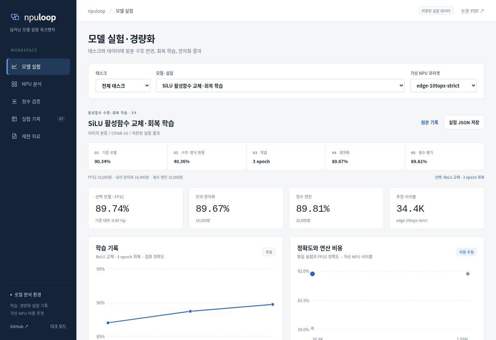

# npuloop 화면 사용 안내

다섯 화면을 차례로 지나는 둘러보기 GIF 는 저장소 README 에 있습니다.

## 모델 실험·경량화 (기본 화면)

공고의 모델 개발 업무에 맞춰 **태스크·데이터 → 모델 변경 → 회복 학습 → 양자화 → 평가**를 첫 화면으로 구성했습니다. 기본 실험은 E4 SiLU→ReLU 3 epoch 회복 학습, 기본 비용 조건은 `edge-10tops-strict`입니다.

- 태스크와 모델·실험 선택으로 E1 기준 학습, E4 활성함수·QAT·보정, E6 프루닝, E9 ViT 변경, E2 PTQ 방식, E12 Imagenette, E17 초해상도 결과를 비교합니다.
- 변경안 행을 선택하면 해당 모델의 FP32·모의 양자화·정수 평가와 실제로 저장된 epoch별 검증 정확도가 표시됩니다. E4 기본 화면은 교체 직후 40.36%와 3 epoch 후 89.74%를 함께 보여 줍니다.
- 정확도 하락 허용값과 최소 사이클 절감 조건은 동일 평가 범위·동일 비용 프리셋에 기록이 있는 변경안에만 적용합니다. 조건 미충족과 근거 부족은 다른 상태입니다. E6의 strict 비용처럼 기록되지 않은 값은 `미기록`으로 남습니다.
- E6 `int8_acc`는 **모의 양자화**입니다. E9 FP32 10,000장과 정수 평가 2,000장을 구분합니다. 초해상도는 PSNR(dB)로 표시하고 분류 정확도 조건을 적용하지 않습니다.
- 원본 JSON과 비교 결과·조건·출처를 내려받을 수 있습니다. 브라우저 안에서 학습이나 칩 실행이 발생하는 것은 아닙니다.

**내 모델로 실험 실행**에는 실제 Python 실행 명령과 `study.json` 가져오기가 있습니다. 실행기는 구조 변경 직후의 대조군, 학습 후 모델, PTQ·정수 경로를 같은 시험 이미지로 평가합니다. 가져온 JSON은 형식과 평가 범위를 검사하며 사용자 실행 결과로 표시합니다. 자세한 입력 규격은 [STUDY_RUNNER.md](STUDY_RUNNER.md)에 있습니다.

## NPU 분석

기본 모델은 ViT-128/6, 기본 가상 프리셋은 edge-10tops-strict입니다. 선택한 조건의 결과가 바로 표시됩니다.

| 탭 | 기능 |
|---|---|
| 분석 요약 | 추정 사이클, 호스트 비용, 미지원 노드, 배열 활용률, 경로별 비용, 상위 비용 노드 |
| 연산자 상세 | 노드 검색·경로 필터·정렬, 노드 비용·입력·출력 연결 관계, CSV 내보내기 |
| 변경 비교 | 같은 조건의 E9 변경 전후 기록; 기록이 없는 조건은 빈 상태 |
| 비용 설정 | PE 배열, 코어 수, DRAM 대역폭, depthwise 엔진, 활성함수 처리 조건 |

모델 변경은 현재 비용 조건을 유지합니다. 프리셋 변경과 초기화는 해당 프리셋의 기본 비용 조건으로 복원합니다.
사용자 비용 설정에서 기존 변경 후 실험 수치를 추측하거나 다른 조건의 실험을 가져오지 않습니다.
GELU/SiLU/HardSwish 처리 옵션 변경은 LayerNorm·softmax 등의 지원 제한을 바꾸지 않습니다.

상단 분석 JSON 내보내기는 선택 모델·프리셋·사용자 설정·노드별 비용 및 추정 출처를 포함합니다.
그래프 파라미터는 trace 및 BN folding 이후 정적 그래프의 파라미터 수입니다. 원본 학습 모델 전체 파라미터 수와 다를 수 있습니다.

## 정수 검증

모델 6종 및 채널별/텐서별 양자화 방식의 E15 측정을 선택할 수 있습니다.
상단은 전체 평가셋(CIFAR-10 10,000장, Imagenette 3,925장)의 정확도와 출력 정숫값 불일치입니다.
연산자별 차이는 고정된 250/125장 배치이며 상단 전체 평가셋과 구분합니다.

노드별 측정값은 펼쳐 검색할 수 있습니다. E16은 ViT의 모의 실행 LayerNorm만 바꾼 실험이고,
E9 활성함수 변경 및 추가 학습과 같은 실험이 아닙니다. E17은 별도의 초해상도 평가입니다.
원본 기록 버튼과 측정 JSON 내보내기는 저장된 해당 실험을 그대로 반환합니다.

## 실험 기록

실험 이름·설명 검색과 카테고리 필터를 지원합니다. E1–E20 데이터가 들어 있습니다.
선택 실험의 모델별 필터와 페이지 이동으로 기록을 조회합니다.
표의 주요 필드 외 중첩 데이터는 개별 기록의 상세 JSON에서 확인합니다.
원본 JSON 저장은 필터로 표시된 일부 표가 아닌 해당 실험 전체 데이터입니다.

## 재현 자료

논문 PDF, 실행 안내, GitHub 소스와 검증 범위가 연결됩니다.
내부 NumPy/C++ 대조, TFLite 일부 참조 커널 대조, 비용 모델 대조, 실제 NPU 미검증을 구분합니다.

## 구현

`demo/index.template.html`, `workbench.css`, `workbench-ui.js`, `study.css`, `study-ui.js`가 화면을 구성합니다.
`study-data.js`는 기존 실험의 학습·평가·비용과 출처 포인터를 읽고 같은 조건의 변경안을 비교합니다.
`workbench-model.js`는 분석·결과 변환을, `cost-model.js`는 기존 수식의 가상 비용 계산을 담당합니다.
`guided-data.js`는 이전부터 검증한 저장 결과 읽기 전용 어댑터이며, 이전 안내형 화면 코드와는 별개입니다.

`demo/build.py`가 모든 CSS·스크립트·데이터를 삽입해 `docs/index.html` 및 `demo/index.html`을 동일하게 생성합니다.
기존 안내형 CSS·컨트롤러는 사용하지 않습니다. 기록 JSON은 수정하지 않습니다.

구버전 `#cost`, `#intake`, `#prune`, `#ptq`, `#tflite` 링크는 대응하는 새 영역으로 연결됩니다.
새 페이지 주소는 `#studies` (기본), `#studies/e6-resnet20_relu`, `#analysis`, `#analysis/operators`, `#analysis/comparison`, `#analysis/settings`,
`#research`, `#experiments`, `#resources`입니다.

화면 검사 명령은 `python tools/check_study_browser.py --report runs/model-study/study.json` 및 `python tools/check_workbench_browser.py`입니다. CI의 `model-workbench` 작업은 실제 학습부터 JSON 가져오기까지 연결해 검사합니다.
